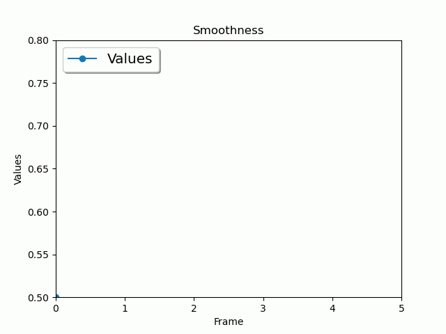

.. _solver-design-heading:

Solver Design
=============

Many users of MatchMove software find that by understanding how the
underlying processes of the software work they are able to obtain better
results by utilising the software as it's intended to work.

This document tries to answer that question;

   *How does the MM Solver work?*

.. _solver-design-how-does-it-work:

How does the solver work?
-------------------------

The solver inside MM Solver is an *optimisation* solver. The solver
attempts to optimise the *measured error* with various *unknown
parameter* values. The solver's purpose is to find the parameter values
which minimise the *measured error*.

The process of applying an *optimisation* solver to 3D perspective
cameras, 2D points and 3D points is called Bundle Adjustment (BA). BA is
traditionally the last step of MatchMove and Photogrammetry solvers
where the parameters of 3D points (Bundles) and cameras are solved to
produce a 3D Scene with the least possible error.

.. _solver-design-attributes:

Attributes
----------

In the MM Solver, we refer to *unknown parameters* as Attributes.
Attributes are the Maya attributes that are allowed to be modified
inside the solver. Maya attributes that are not added into the solver
will still be used, but cannot be modified.

The Attributes modified in the MM Solver may be **any** attribute in
Maya. Likewise the attributes may be in any space required, for example;
object-space, world-space or normal/vertex space. The only requirement
is that the Attribute modifies the *Bundle* position (see below for
detail on *Bundles*). *Bundle* positions may be modified indirectly
using hierarchies or rigs of Maya transform nodes. The true power of the
solver comes from the evaluation environment, Maya, and the node
networks/hierarchies created by the MatchMove artist.

Like Maya attributes, MM Solver Attributes can also change over-time
using an *animated* curve, or just have a single *static* value, or they
can be be *locked*. *Locked* attributes cannot be modified by Maya and
therefore cannot be modified in the solver either. Due to underlying
solving algorithm only floating-point attribute values can be solved.
Commonly solved Attributes are 3D translate and rotate axes.

.. _solver-design-markers-and-bundles:

Markers and Bundles
-------------------

*Markers* and *Bundles* are used to compute the *measured error* inside
the solver. The word *Marker* is used to describe a 2D point on an image
plane, and *Bundle* to describe the 3D Point.

*Markers* have had different names in various MatchMove software
applications; Track, feature, 2D point, etc. For the purposes of MM
Solver name *Marker* is used for the tracking markers placed on the set
of a film production. *Bundles* are named as such because they represent
a bundle of light forming on the imaging sensor.

*Markers* and *Bundles* are linked together. The *Marker* is the
representation of the *Bundle* from a camera's point of view. There may
be multiple 2D *Marker* representations of the same 3D *Bundle*.

Having known 2D Markers of a 3D Bundle looking through a known
perspective *Camera* we can calculate a 3D *Bundle* position by moving
the *Bundle* until the difference between all Markers and Bundles is
zero when looking through each perspective *Camera*. Another way to say
this is that the *measured error* is the distance between the
screen-space re-projected 3D Bundles with the linked 2D Markers.

.. _solver-design-solving:

Solving
-------

Once the solver has *Attributes*, *Cameras* and *Markers* and linked
*Bundles*, the solver can start a solve.

The solver may only start if some conditions are met. One important
condition is the number of Attributes verses the number of Markers or
specifically:

   The number of *measured errors* must be equal to or greater than the
   number of *Attribute* values you're solving.

All 3D MatchMove software has this limitation, MM Solver is no
different. There is a minimum number of Markers required to solve for a
3D Camera that can move in 6 degrees of freedom (6 DOF: translate X, Y
and Z, rotate X, Y and Z). For MM Solver this number is a **minimum** of
3 Markers. 3 Markers are required to solve for 6 attributes.

Since each *Marker* measures 2 errors (X and Y distance to *Bundle*),
the marker can solve for 2 attributes. For example, 1 *Marker* can be
used to solve a *Camera* transform rotate X and Y (tilt and pan)
attributes.

When the user gives a *Marker* as input for MM Solver, the position is
assumed to be correct. Some 3D MatchMove software applications use many
2D Markers and filter out the badly tracked points (the *outliers*), MM
Solver does not work like this. Badly tracked *Markers* will affect the
solve badly.

This solver is an optimiser and it needs to be provided with an
approximation of input attribute values, or in other words; we need to
animate the camera(s), and place the bundles in the roughly correct
positions. You don't need to do the job of the solver, which is to make
the *Cameras* and *Bundles* match perfectly, but you are required to at
least have *Bundles* positioned inside the FOV of the camera, and an
approximate animation of the camera if you're solving the camera
parameters.

The approximate *Camera* and *Bundle* positions is why the MM Solver is
so different from traditional MatchMove solutions, especially
Auto-Tracking 3D MatchMove software; there is no one-click solution. But
this can be a good thing!

Remember the solver is an optimiser and it re-uses the input parameters
and refines them rather than re-starting the solve from scratch. This
type of solver enables customised, layered solving. For example, you may
solve for a small number of individual Attributes with specific sets of
*Markers* and *Bundles*, or you could use it in a similar way to other
3D MatchMove software where all parameters are added into the solver.

Due to the inherent refinement nature of the solver, a general process
for solving will be:

#. Add Cameras, Bundles and Markers.
#. Track 2D *Markers*.
#. Place *Cameras* and *Bundles* into approximate positions.
#. Set up movement constraints or node hierarchies for *Cameras* and /
   or *Bundles*.
#. Solve for Attribute values.
#. Repeat steps 2-5 until desired result is achieved.

.. _solver-design-solving-process:

Solving Process
---------------

Each time you execute a solve, the solver goes though a number of steps
to perform the optimisation and reduce the error.

This is an overview of the solver's process:

#. Initialises input data.
#. Solve.

   #. Measure Initial Error.

      #. Set all the initial Attribute values.
      #. Measure the initial re-projection error.

   #. Discover how each Attribute changes the *measured error*.
   #. Iterate.

      #. Based on the discovered value/error changes predict better
         Attribute values.
      #. Set all Attribute values with the predicted Attribute values.
      #. Measure the re-projection error.
      #. Check if the error is low enough, if so stop solving, otherwise
         repeat the iteration.

#. Get solver information.

   #. Set attributes values as calculated.
   #. Measure Final Error.
   #. Get number of iterations.

#. Return Solver information to the user.

The slowest step of the solving process is step 2 as it may be executed
hundreds or thousands of times, depending on the number of *Attributes*
and *Markers* that are in the solve.

.. _solver-design-static-and-animated-attributes:

Time - Static and Animated Attributes
-------------------------------------

Up until now we've been concerned with solving a single frame in time.
Now we need to extend that into multiple frames. In the MM Solver there
are *animated Attributes* that change per-frame and *static Attributes*
that only have one value. Using *static Attributes* complicates the
solving process.

If we are to solve only per-frame that would mean Attribute values from
one frame would never affect another frame and therefore we can safely
loop over each frame and solve each frame individually. When including
*static Attributes*, the *static Attributes* affect all frames in the
solve.

Consider a simple example; 1 *animated Attribute* and 1 *static
Attribute*, solving on three frames, frame 1, 2 and 3. The animated
attribute contains 3 values, an individual value for each frame, and so
each value affects the *measured error* on each frame. But the *static
Attribute* contains only one value, not one for each frame, and
therefore the single value affects the *measured error* on all frames.
To solve for the minimum possible *measured error* for all values it is
necessary to consider all 4 values together (3 animated values, 1 static
value), and all combinations of the values. Solving for 4 values rather
than 3 values doesn't sound like it would take much longer to compute,
but in fact it takes 3 times longer (3 \* 3); this problem is squared
each time a static value is added. The more static values added to the
solve increases the number of possible combinations and increases the
number of solver evaluations required for a low *measured error*.
Solving Animated and Static values as described is a **Brute Force**
approach, but other strategies may be used.

.. _solver-design-time-evaluation:

Attribute Value Evaluation at Different Times
---------------------------------------------

This topic is unrelated to the actual solver engine in mmSolver, but
documents an interesting implementation detail when correctly
evaluating values at different times in Autodesk Maya. From mmSolver
v0.3.10 the new mmSolver command flag 'timeEvalMode' was introduced to
tell Maya how to evaluate values at different times.

There are two different methods to query a value at a specific time,
**1**) tell the Maya DG network to evaluate a value at a time (using a
"DG Context"), or **2**) change the Maya scene's current time, then
query the current value.

Tests have shown that the two different methods do not always evaluate
the same way and can lead to an incorrect solve if set
incorrectly. For simple scenes, method **1** works most of the time,
however when using character rigs or complex node networks and
evaluating on a single frame, then method **2** is needed to solve
correctly.

Use method **1** when you are solving multiple frames at once, and you
 are using the Maya GUI (not Maya Batch or 'mayapy').

Use method **2** when you are evaluting a single frame, or
when you are not using the Maya GUI such as with Maya Batch or
'mayapy'.

These different methods do not need to be set manually if you are
using the mmSolver Solver UI or the mmSolver API. If you are calling
the 'mmSolver' command directly, then 'timeEvalMode' is important to
set.

.. _solver-design-attribute-details:

Attribute Details
-----------------

Attribute Details are properties of an Attribute. Attribute Details
are used to add constraints such as value limits.

In mmSolver, there are 4 individual details per-attribute; minimum,
maximum, smoothness and stiffness. See below for more details on how
each property works.

Minimum and Maximum Limits
^^^^^^^^^^^^^^^^^^^^^^^^^^

Minimum and maximum limits will force *mmSolver* to solve an attribute
with-in specific values. Attribute min/max limits apply to both static
and animated attributes. If a mnimium or maximum value is not set, the
limit is removed and any value may be used.

*mmSolver* allows a combination of minimum and maximum limits. The
combinations are; minimum only, maximum only, both minimum and
maximum, no to limits at all.

Although min and max limits may appear to be an appealling feature,
often the need to use limits is a sign of problems in your solve.
Minimum and maximum limits are often not helpful because the solver
will simply limit the values used rather than reduce the likely-hood
the solver will try to use values outside the limits.

Minimum and maximum limits are also known as "Upper and Lower Value
Bounds".

Smoothness and Stiffness
^^^^^^^^^^^^^^^^^^^^^^^^

Smoothness and stiffness ensures a Animated Attribute curve follows a
constraint by increasing the error level of the current solve when the
curve does not behave as expected. By increasing the solver error for
"bad behaviour" the solver will automatically try to re-distribute the
error level by changing other Attribute values.

Both *smoothness* and *stiffness* use a similar constraint. The solver
will increase the error if the solved value varies by more than the
*variance* compared to a reference value. This encourages the
solver to reduce "jumps" of more than the *variance* value.

For *smoothness* constraints, the reference value is a smoothed value
along the curve, based on the previous value. The value at the next
frame is a predicted value, but is allowed to vary.

For *stiffness* constraints, the reference value is the previous
solved value. This ensures the solver continues to use the same
value. *Stiffness* is a useful constraint for curves which should stay
flat, but will still vary a little. The focal length of a camera might
be a good example for this type of constraint.

Both *smoothness* and *stiffness* constrains have a *variance* and
*weight* value for each attribute. The *variance* value controls how
much the solver can change from the reference value, if the solver
chooses a value that varies by more than the *variance* a large error
is given to the solver. The *weight* value controls how strong the
constraint is used inside the solver; lower values means the
*stiffness* or *smoothness* has smaller effect, and higher values
increases the effect.

.. _solver-design-solver-strategies:

Solver Strategies
-----------------

Solver strategies are patterns of evaluation that attempt to solve the
input attributes across time while reducing the number of evaluations
and increasing solve quality.

To reduce *measured error*, the ideal strategy for solves with only
animated attributes is the **Per-Frame** strategy, while the ideal
strategy for animated and static attributes is **All Frames**

-  Per-Frame
-  Two Frames (Forward / Backward)
-  Three Frames (Forward / Backward)
-  All Frames (Brute-force)

In practice, a mixture of multiple strategies may be the best approach.

Primary Frames / Root Frames.

#. Extending the baseline
#. Hierarchical merging of sub-sequences
#. Incremental bundle adjustment

.. _solver-design-solver-options:

Solver Options
--------------

Like many solvers, the MM Solver has options, however the options are
hidden from the Solver UI and are set automatically by the Python API.

To explain the Solver Options below an analogy of climbing a mountain,
to reach the peak (top of the mountain) is used. Our goal is to find
the exact parameters that will bring us to the peak of the
mountain. Our position on the mountain tells us how high we are (the
deviation level), and the direction upwards to the top of the mountain
peak (the gradient or mountain slope).

.. figure:: images/algorithm_steepest_decent.png
    :alt: Mountain Climbing
    :align: center
    :width: 80%

    Mountain Climbing with Steepest Decent

.. _solver-design-solver-max-iterations:

Maximum Number of Iterations
^^^^^^^^^^^^^^^^^^^^^^^^^^^^

Value type: ``integer``

This option does not directly control the number of evaluations
the solver may run, but instead controls how many attempts the
solver will try before giving up.

If the solver attempts to solve more than the maximum iterations the
solve will stop.

.. _solver-design-solver-tau:

Tau - Initial Damping Factor
^^^^^^^^^^^^^^^^^^^^^^^^^^^^

Value type: ``float``

The *tau* factor determines whether the solver will try to refine the
current parameters a lot (large tau number), or only a small amount
(small tau number). Values usually range between +0.0 and +1.0.

Larger values should be used when the initial unknown parameters
have high error. This forces the Levenberg-Marquet algorithm to use
steepest-decent, rather than gauss-newton.

"The algorithm is not very sensitive to the choice of 'tau', but
as a rule of thumb, one should use a small value, eg 'tau = 10-6',
if 'the initial parameters' are believed to be a good
approximation to the 'final parameter values'. Otherwise, use 'tau
= 10-3' or even 'tau = 1.0'."

.. _solver-design-solver-delta:

Delta - Amount to Change Parameters
^^^^^^^^^^^^^^^^^^^^^^^^^^^^^^^^^^^

Value type: ``float``

Delta is the amount of change to the guessed parameters at each
iteration.

Each time the solver guesses an unknown parameter value, it adds
or subtracts the 'delta' value from the unknown parameter
value. This changes the magnitude of the parameter values in each
guess. If this value is too small, the change in error level may
not be detected, if this value is too large the solver will
over-estimate and will likely lead to poor convergence (the solver
won't find a good solution).

.. _solver-design-solver-epsilon-one:

Epsilon #1 - Acceptable Gradient Change
^^^^^^^^^^^^^^^^^^^^^^^^^^^^^^^^^^^^^^^

Value type: ``float``

The gradient error (sometimes named epsilon #1) is used to find when
the solver has reached the "top of the mountain peak". The gradient
represents the slope of climbing the mountain. When the solver reaches
a (horizontally) flat area of the mountain, then the gradient is low,
and will stop the solve. When the solver can find a slope (gradient),
then the solver can follow the slope of the mountain and reach the top
of the mountain peak.

At the beginning of a solver iteration, if the solver has not
decreased the gradient by at least this value, the solver gives up
trying to reduce the error any more, and stops solving.

.. _solver-design-solver-epsilon-two:

Epsilon #2 - Acceptable Parameter Change
^^^^^^^^^^^^^^^^^^^^^^^^^^^^^^^^^^^^^^^^

Value type: ``float``

The parameter error (sometimes named epsilon #2) is used to determine
the when the solver can stop changing parameter values because the
new parameter values have not changed enough. Changes to parameters are
able to move the solved solution to different places on the mountain,
if the parameter changes are too small then the solver will stop.

At the beginning of a solver iteration, if the guessed parameters do
not change by at least this value, the solver gives up trying to
reduce the error any more.

.. _solver-design-solver-epsilon-three:

Epsilon #3 - Acceptable Deviation Error
^^^^^^^^^^^^^^^^^^^^^^^^^^^^^^^^^^^^^^^

Value type: ``float``

The deviation error (sometimes named epsilon #3 or deviation) is the
error level that is considered a good solve. To use a mountain
climbing analogy, the *deviation error* is the highest mountain peak
that is good enough for the solver.

At the beginning of a solver iteration, if the error level is below
this value, the solver considers the error to be low enough for the
user's needs and stops trying to reduce the error.

.. _solver-design-solver-auto-diff-type:

Auto-Differencing Type
^^^^^^^^^^^^^^^^^^^^^^

Value type: ``integer``

The strategy used to compute the direction (gradient slope) the solver
should move toward.

.. list-table:: Auto-Differencing Types
   :widths: auto
   :header-rows: 1

   * - Index
     - Name
     - Description

   * - 0
     - ``forward``
     - Fast but not accurate.

   * - 1
     - ``central``
     - More accurate but 1/3rd slower to compute initially.

In practice, the authors of mmSolver have found ``central``
dramatically slows down the solver and does not increase accuracy very
much. It is therefore recommended to use ``forward``.

General Solving Concepts
------------------------

**To be written**

Over-Parameterization
^^^^^^^^^^^^^^^^^^^^^

Parameters-errors ratio is too high.

**To be written**

Plane, Line and Curve Constraints
^^^^^^^^^^^^^^^^^^^^^^^^^^^^^^^^^

**To be written**

.. _solver-faq-heading:

Frequently Asked Questions (FAQ)
--------------------------------

Below are the some common questions and answers.

.. _solver-faq-how-to-get-supported-solver-types:

How do I get the list of supported Solver Types?
^^^^^^^^^^^^^^^^^^^^^^^^^^^^^^^^^^^^^^^^^^^^^^^^

To dynamically get the supported list of solver types, run this Python
command in Maya::

   >>> maya.cmds.loadPlugin('mmSolver')
   >>> maya.cmds.mmSolverType(query=True, list=True)
   [u'1=cminpack_lmdif', u'2=cminpack_lmder']   # Example output.

The full list of solver types supported are listed below. Please note
that depending on compilation, some solver types will not be available.

.. list-table:: Solver Types
   :widths: auto
   :header-rows: 1

   * - Index
     - Name
     - Description

   * - 0
     - ``levmar``
     - Use levmar_ library with the ``levmar_bc_dif`` function.

   * - 1
     - ``cminpack_lmdif``
     - Use CMinpack_ library with the lmdif_ function.

   * - 2
     - ``cminpack_lmder``
     - Use CMinpack_ library with the lmder_ function.

.. _solver-faq-what-transform-space-is-used-for-solving:

What transform space is used for solving?
^^^^^^^^^^^^^^^^^^^^^^^^^^^^^^^^^^^^^^^^^

*MM Solver* evaluates all *Marker* and *Bundle* screen-space errors in
**world-space**, but solving is not performed in a transform space.
Solving is performed directly on *Attribute* values.

.. _solver-faq-how-to-reduce-attribute-count-with-dag:

How can I use a DAG hierarchy to reduce the number of *Attributes*?
^^^^^^^^^^^^^^^^^^^^^^^^^^^^^^^^^^^^^^^^^^^^^^^^^^^^^^^^^^^^^^^^^^^

**To be written**

.. _solver-faq-how-to-increase-solve-speed:

How can I make my solves faster?
^^^^^^^^^^^^^^^^^^^^^^^^^^^^^^^^

**To be written**

.. _levmar:
   http://users.ics.forth.gr/~lourakis/levmar/

.. _CMinpack:
   http://devernay.free.fr/hacks/cminpack/index.html

.. _lmdif:
   http://devernay.free.fr/hacks/cminpack/lmdif_.html

.. _lmder:
   http://devernay.free.fr/hacks/cminpack/lmder_.html
