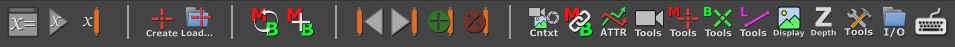

Tools
=====

Most users will use the tools listed below to control and manipulate
the MM Solver. There are also utilities to help the MM Solver
workflow.

Pages dedicated to specific tools:

.. toctree::
    :maxdepth: 2

    tools_solver_ui
    tools_createnode
    tools_selection
    tools_attributetools
    tools_markerbundletools
    tools_bundletools
    tools_markertools
    tools_generaltools
    tools_hotkeys
