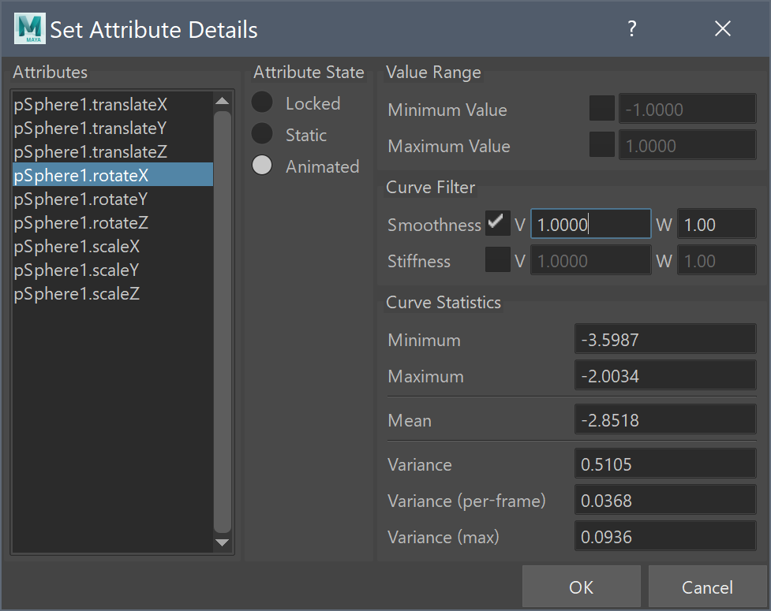
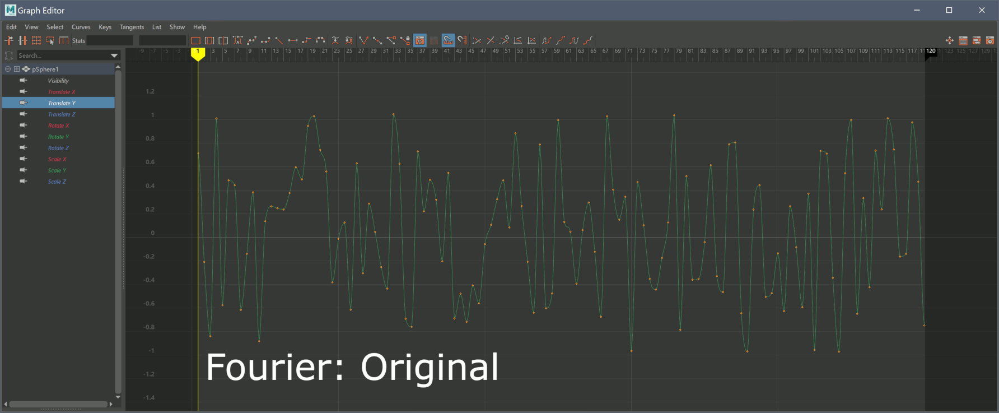
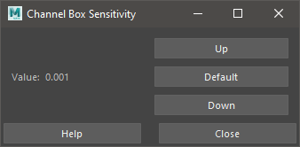
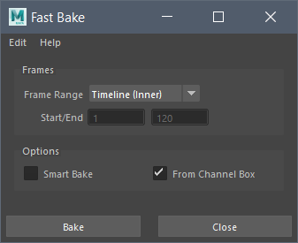

Attribute Tools
=================

Attribute tools are used to create and modify attributes, and
attribute values.

Set Attribute Details
---------------------

The Attribute Details tool is used to add details (properties) to an
individual Attribute. Details are stored per-collection, therefore a
Collection must exist to use the tool.

This tool can be used to:

- Set Attribute Details on individual Attributes.

- Change Attribute states; to lock an attribute, or set a keyframe on
  the attribute.

- View the current Attribute Details on an Attribute.

- View the Animation Curve statistics;

  - Minimum value of the animation curve.

  - Maximum value of the animation curve.

  - Mean (Average) value of the animation curve.

  - Variance of the total animation curve.

  - Variance (per-frame) of the animation curve; how much does the
    animation curve change per-frame.

Attribute Details are used by mmSolver to ensure properties are
maintained while solving. See the Solver Design
:ref:`solver-design-attribute-details` page for more information.

Usage:

#. Ensure a Collection exists.

   - Open Solver UI, and create Collection node with menu; `File > New
     Collection`.

#. Select nodes (and attributes in channel box, if required).

#. Open `Set Attribute Details` UI.

#. Select an Attribute (left-hand side) and modify the Details (right-hand side).

#. Click 'Ok' to accept the changes.

Run this Python command:

.. code:: python

    import mmSolver.tools.setattributedetails.tool as tool
    tool.open_window()

.. _smooth-keyframes-tool-ref:

Smooth Keyframes
----------------

Smooth the selected keyframes in the Graph Editor, along with a UI to
change the affect of the Smoothing function. The UI values are saved
into the home directory and will be re-used when a new Maya session is
opened.

The Smooth Keyframes tool allows smoothing of only specific keyframes,
even if the curve is not baked per-frame. The tool will also attempt
to control the smoothed values as they blend into unsmoothed
values. This allows smoothing a specific area of an animation curve,
while preserving other parts and avoiding bumps at the boundry.

Usage:

1) Use the menu ``mmSolver > Attribute Tools > Smooth Keyframes UI``.

2) Edit the options in the UI.

   - *Function* controls the type of smoothing that is calculated.

   - *Smooth Width* controls how much the smoothing function will be
     applied. The width is number of frames to be used for smoothing,
     for example a value of 1 means "no smoothing", a value of 2 means
     "use previous and next frame", and 5 means "use previous 4 and
     next 4 frames".

3) Select keyframes in Graph Editor.

4) Run 'Smooth Selected Keyframes' tool.

5) Keyframe values will be smoothed.

6) Repeat steps 3 to 5 as required.

You can use the below Python code on a hotkey of your choosing. To
run the tool, use this Python command:

.. code:: python

    import mmSolver.tools.smoothkeyframes.tool as tool

    # Smooth the selected Keyframes
    tool.smooth_selected_keyframes()

    # Open the Smooth Keyframes UI.
    tool.main()

Blend Width
+++++++++++

When the *Smooth Keyframes* tool is run the selected keyframes are
smoothed as well as frames surrounding the selected keyframes. The
surrounding keyframes are blended together with the smoothed
keyframes. The *Blend Width* value controls the number of frames to
blend.

The image below shows the effect of the *Blend Width* value.

.. figure:: images/tools_smooth_keyframes_blend.gif
    :alt: Selected Keyframes Blending Value
    :align: center
    :width: 90%

Function Average
++++++++++++++++

The *Average* smoothing function will average the surrounding keyframe
values equally.

The image below shows the effect of the *Smooth Width* with the
*Average* function.

.. figure:: images/tools_smooth_keyframes_average.gif
    :alt: Smooth Keyframes with Average
    :align: center
    :width: 90%

Function Gaussian
+++++++++++++++++

The *Gaussian* smoothing function performs a strong smooth on the
keyframes. The *Gaussian* function can be used to make a curve very
flat, without any changes. Unlike the *Fourier* function, the
*Gaussian* function will change already smooth keyframes.

This function is similar to 2D image Gaussian blurring.

The image below shows the effect of the *Smooth Width* with the
*Gaussian* function.

.. figure:: images/tools_smooth_keyframes_gaussian.gif
    :alt: Smooth Keyframes with Gaussian
    :align: center
    :width: 90%

Function Fourier
++++++++++++++++

The *Fourier* smoothing function performs a high-pass-filter to the
selected keyframes. Keyframes with rapid changes are smoothed more
than already smoothed values.

This function is similar to 2D image high-pass filtering techniques,
to remove *high-contrast* edge detail.

The image below shows the effect of the *Smooth Width* with the
*Fourier* function.

.. _channel-sensitivity-tool-ref:

Channel Sensitivity
-------------------

Channel sensitivity tool helps you to change the value of sensitivity
of channel slider setting. Using this tool the user to adjust
attributes in the Channel Box by very small increments, which is
useful for manually adjusting or matching parameters interactively.

Usage:

1) Run tool.

   - A UI will open, click the `Up` or `Down` buttons to
     change the sensitivity.

2) Select an Attribute in the Channel Box.

3) Middle-mouse drag in the viewport to change the attribute value.

To run the tool, use this Python command:

.. code:: python

    import mmSolver.tools.channelsen.tool as tool
    tool.main()

.. _bake-attributes-tool-ref:

Bake Attributes
---------------

Bake Attributes will bake the values of an attribute on each frame and
replace the connection with an animation curve.

This tool is almost identical to the default Maya ``Edit > Keys > Bake
Simulation`` tool, but has additional features.

- The viewport is always disabled while baking.

- The tool is optimised for speed of baking.

- The tool UI is reduced to only the nessarary features for matchmove
  tasks.

Usage:

#. Select 1 or more nodes.

#. Select attributes in channel box (if required).

#. Open `Bake Attributes` UI.

   - Enable the `Smart Bake` to set keyframes only on some keyframes.

   - Disable `From Channel Box` to bake all keyable attributes, not
     just the selected attributes.

#. Press `Bake` button.

.. note:: In Maya scenes that rely on legacy viewport update for
          correct evaluation, this tool may produce incorrect results
          (because the viewport is disabled). If this happens, please
          use Maya's default ``Edit > Keys > Bake Simulation`` tool. In
          the experience of the tool authors, this has never happened
          and this tool is a faster baking tool.

Run this Python command:

.. code:: python

    import mmSolver.tools.fastbake.tool as tool
    tool.open_window()

    # To run the "fast bake" tool directly (with currently set
    # options).
    tool.main()

.. _attribute-curve-filter-pops-tool-ref:

Attribute Curve Filter Pops
---------------------------

.. figure:: images/tools_attribute_curve_filter_pops_ui.png
    :alt: Attribute Curve Filter Pops UI
    :align: center
    :width: 80%

The `Attribute Curve Filter Pops` tool is used to detect and remove
unwanted spikes or "pops" in animation curves. These sudden value
changes can occur during animation or when solving, and this tool
helps smooth them out while preserving the intended animation.

For example, after solving a camera with noisy tracking data, you may
get small value spikes/pops in the animation curves. This tool can help
remove those spikes.

The tool works by analyzing each keyframe and comparing the value
changes between neighboring frames. When the change exceeds the
specified threshold, it's identified as a pop and filtered out.

Usage:

1) Select nodes with animation curves.

   - The tool will look for selected attributes in the Channel Box.
   - Or selected Graph Editor Outliner attributes.
   - Or selected keyframes in the Graph Editor.

2) Open the Attribute Curve Filter Pops UI:

   - Menu: ``mmSolver > Attribute Tools > Attribute Curves Filter Pops``

3) Configure the options:

   - Set the frame range to process.
   - Adjust the threshold value that determines what constitutes a "pop".

4) Click "Apply" to filter the animation curves.

   - The tool will apply to multiple attributes at once.

Python Command:

.. code:: python

    import mmSolver.tools.attributecurvefilterpops.tool as tool

    # Run the filter with current settings
    tool.main()

    # Open the UI window
    tool.open_window()

Notes
+++++

- The tool requires animation curves on the attributes to filter. If
  attributes aren't animated, bake them to animation curves first.
- The threshold determines what constitutes a "pop" - experiment with
  different values to find what works best for your animation.
- Use the Graph Editor to visually inspect the results after
  filtering.
- All operations can be undone if needed.
- For general animation curve smoothing (rather than spike removal),
  consider using the :ref:`Smooth Keyframes
  <smooth-keyframes-tool-ref>` tool instead.

Options
+++++++

- **Frame Range** - Choose how to determine which frames to process:

  - *Timeline (Inner)* - Uses the inner timeline range (highlighted region)
  - *Timeline (Outer)* - Uses the outer timeline range
  - *Custom* - Manually specify start/end frames

- **Start/End** - When "Custom" frame range is selected, specify the exact frame range to process

- **Threshold** - Controls how aggressively pops are detected and filtered:

  - Default value is 1.0,
  - Higher values (above 1.0) remove less pops, only fixing large spikes.
  - Lower values (below 1.0) remove more pops, smoothing out smaller variations.
  - For typical matchmove solves, however values between 0.5 and 1.5 work well.
