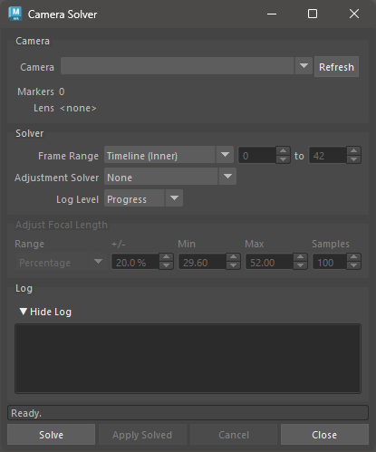
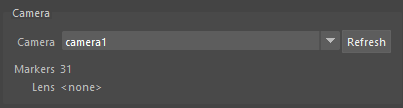
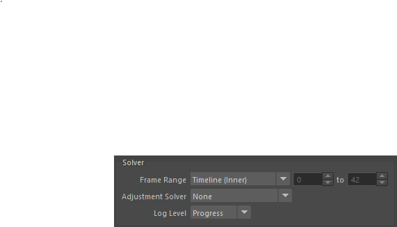
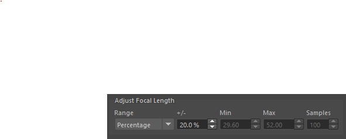
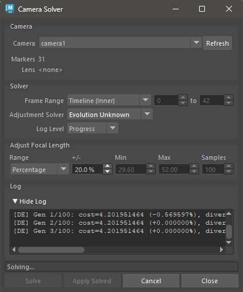
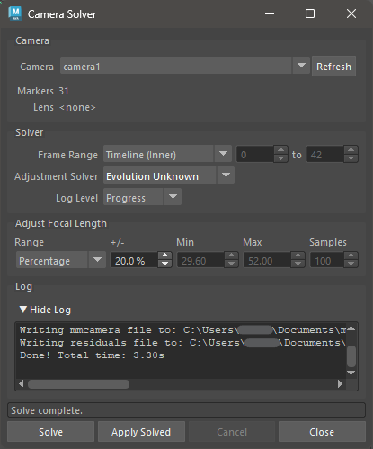

.. _camera-solver-tool-ref:

Camera Solver
=============

The `Camera Solver` tool reconstructs animated camera motion and static 3D
bundle positions "from scratch" - using only 2D marker tracks and the camera's
initial focal length and lens distortion settings.

See :ref:`camera-solver-overview-heading` for a detailed technical overview.

    Camera Solver User Interface

Usage
~~~~~

1) Select a camera node, or activate a camera viewport.

2) Ensure `Markers` are parented under the camera and contain 2D track data.

3) Open the `Camera Solver` UI.

   - The **Camera** drop-down will auto-populate from the scene and
     pre-select the active camera.  Press **Refresh** if you add new
     cameras after opening the window.

   - The **Markers** count shows how many markers are found under the
     selected camera.  The solve requires at least a few markers with
     tracks across the frame range.

4) Set the **Frame Range** and any solver options (see below).

5) Press **Solve**.

   - The solve runs as a background process; Maya remains interactive.
   - Progress is shown in the **Log** area and the status bar.
   - Press **Cancel** at any time to stop the solve.

6) When the solve completes, press **Apply Solved** to write the results
   back onto the camera transform and bundles in the scene.

   - This step is undoable with ``Ctrl+Z``.
   - You can press **Apply Solved** again at any time to re-apply the
     last solve result without re-running the solve.

To open the Camera Solver UI, use this Python command:

.. code:: python

    import mmSolver.tools.camerasolver.tool as tool
    tool.open_window()

Camera Group
~~~~~~~~~~~~

.. list-table::
   :widths: auto
   :header-rows: 1

   * - Field
     - Description

   * - Camera
     - Drop-down listing all non-startup cameras in the scene.  The
       camera selected here is used for the solve.  Press **Refresh**
       to update the list after adding cameras.

   * - Markers
     - Read-only count of `Marker` nodes parented under the selected
       camera.  Updates automatically when the camera selection changes.

   * - Lens
     - Read-only display of the lens distortion node connected to the
       selected camera, or ``<none>`` if no lens is attached.  Lens
       distortion is taken into account during the solve when present.

Solver Group
~~~~~~~~~~~~

.. list-table::
   :widths: auto
   :header-rows: 1

   * - Field
     - Description

   * - Frame Range
     - The frames to solve.  Choose **Timeline (Inner)** or **Timeline
       (Outer)** to follow the Maya timeline bars, or **Custom** to
       type explicit start and end frame numbers.

   * - Adjustment Solver
     - Optional second pass that adjusts camera attributes (such as
       focal length) after the initial reconstruction.  See
       `Adjustment Solver`_ below.

   * - Log Level
     - Controls how much output is written to the **Log** area during
       the solve.  **Progress** (default) shows high-level progress
       messages.  **Debug** is intended for developer diagnostics and
       produces very verbose output.

.. _camera-solver-adjustment-solver-ref:

Adjustment Solver
+++++++++++++++++

The **Adjustment Solver** runs a second optimisation pass after the initial
camera reconstruction and can search for a better focal length.  The options
are:

.. list-table::
   :widths: auto
   :header-rows: 1

   * - Option
     - Description

   * - None
     - No adjustment pass is run.  The focal length is taken directly
       from the camera node and is not changed.

   * - Evolution Refine
     - Uses a Differential Evolution algorithm to refine attribute
       values, starting from the current camera focal length.  A good
       choice when the focal length is approximately known.

   * - Evolution Unknown
     - Uses a Differential Evolution algorithm to search the full
       focal length range.  Slower but more thorough than *Evolution
       Refine* when the focal length is unknown.

   * - Uniform Grid
     - Samples focal length at evenly-spaced values across the search
       range and picks the best result.  The number of samples is set
       by the **Samples** field in the **Adjust Focal Length** group.

Adjust Focal Length Group
~~~~~~~~~~~~~~~~~~~~~~~~~

This group is enabled only when **Adjustment Solver** is not *None*.
It controls the focal length search range used during the adjustment pass.

.. list-table::
   :widths: auto
   :header-rows: 1

   * - Field
     - Description

   * - Range
     - How the search range is defined.  **Percentage** derives the
       min/max automatically from the camera's current focal length.
       **Min / Max** lets you enter explicit bounds in millimetres.

   * - +/-
     - *(Percentage mode only)*  The search range expressed as a
       percentage of the camera's current focal length.  Default is
       20 %.  Higher values broaden the search at the cost of solve
       time.

   * - Min
     - *(Min/Max mode only)*  Minimum focal length to search, in
       millimetres.

   * - Max
     - *(Min/Max mode only)*  Maximum focal length to search, in
       millimetres.

   * - Samples
     - *(Uniform Grid solver only)*  Number of evenly-spaced focal
       length values to evaluate across the search range.  Default is
       100.

Log Group
~~~~~~~~~

The **Log** area displays output from the solver process as it runs.
Press the **▼ Hide Log** / **▶ Show Log** toggle to collapse or expand
the log panel.  All solver messages are appended during the solve and
are not cleared until the next solve starts.

    Camera Solver mid-solve, showing log output and the Cancel button enabled.

The **Log Level** in the Solver group controls the minimum severity of
messages that appear here.

Buttons
~~~~~~~

.. list-table::
   :widths: auto
   :header-rows: 1

   * - Button
     - Description

   * - Solve
     - Launches the camera solve as a background process.

   * - Apply Solved
     - Applies the most recent solve result to the camera transform and
       bundle positions in the Maya scene.  Enabled only after a
       successful solve.  This operation is undoable.

   * - Cancel
     - Cancels the running solve.  The camera and bundles are left
       unchanged.

   * - Close
     - Closes the Camera Solver window.  A running solve is *not*
       cancelled when the window is closed.

    Camera Solver after a successful solve.  Press **Apply Solved** to
    write the results into the Maya scene.

Scene Settings
~~~~~~~~~~~~~~

All Camera Solver options are saved inside the Maya scene file.  This means
each ``.ma`` / ``.mb`` file carries its own solver preferences, and multiple
open Maya sessions can hold independent values.

Python Functions
~~~~~~~~~~~~~~~~

Open the Camera Solver UI window:

.. code:: python

    import mmSolver.tools.camerasolver.tool as tool
    tool.open_window()

Run the solve and apply results without the UI (synchronous - waits for the
solve to finish before returning; press *ESC* key to cancel):

.. code:: python

    import mmSolver.tools.camerasolver.tool as tool
    tool.run_camera_solve_and_load()

Run the solve asynchronously and apply the results in a separate step:

.. code:: python

    import mmSolver.tools.camerasolver.tool as tool

    # Launch the solve (returns immediately).
    tool.run_camera_solve()

    # After the solve completes, apply the results.
    tool.load_solved_camera()
