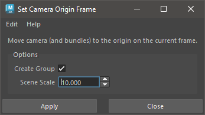

Camera Tools
============

Camera tools are tools specifically designed to create or edit cameras
in some way.

.. _toggle-camera-lens-distortion-tool-ref:

Toggle Camera Lens Distortion
-----------------------------

The `Toggle Camera Lens Distortion` tool is used to quickly enable or
disable the effect of lens distortion on `Markers` and/or `MM
ImagePlane` nodes.

Usage:

1) Activate 3D Viewport or select camera node(s).

2) Run tool (with shelf or menu).

   - The effect of lens distortion for the given cameras is toggled;
     all Markers and MM ImagePlanes will have lens distortion enabled
     or disabled.

   - Press the Maya "g" hotkey on your keyboard to repeat the last
     command, to toggle back and forth.

To run the tool, use this Python command:

.. code:: python

    import mmSolver.tools.togglecameradistort.tool as tool
    tool.main()

.. _set-camera-origin-frame-tool-ref:

Set Camera Origin Frame
-----------------------

The `Set Camera Origin Frame` tool moves a camera (and world-space
`Bundles`) to the origin on the current frame, and normalizes the
scene (Camera and Bundles) scale to a consistent value.

The tool is instended to be used to provide world-space consistency
when solving a camera with no known 3D positions.

Usage:

1) Set current frame to desired 'line-up frame'.

   - The current frame will be used as the "origin frame" - the camera
     transform values will be exactly zero (identity) on this frame.

2) Select Camera node.

   - Bundles are automatically found from the Camera's Markers.

3) Run tool.

   - Optionally, open the `Set Camera Origin Frame` UI to set options.

   - Use `Create Group` to create a transform node above the `Camera`
     and `Bundles` automatically.

   - Use `Scene Scale` to adjust the length the `Camera` and `Bundles`
     is scaled to.

4) If `Create Group` option was enabled, select created
   ``_originGroup`` node and translate and rotate camera into desired
   transform (such as a line up matching the horizon line).

   - Use the ``_originGroup`` node scale attributes to increase the
     size of the scene scale.

5) Re-solve the camera using the :ref:`Solver UI <solver-ui-ref>`.

6) Repeat steps 1 to 3.

To run the tool, use this Python command:

.. code:: python

    import mmSolver.tools.setcameraoriginframe.tool as tool
    tool.main()
