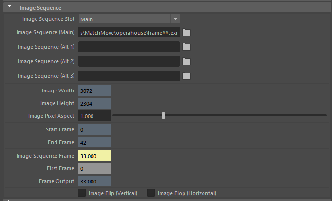
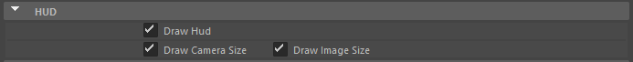
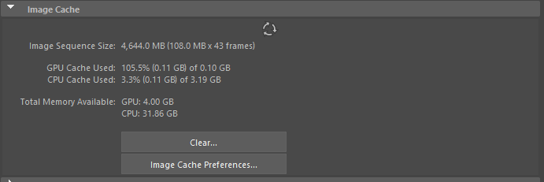
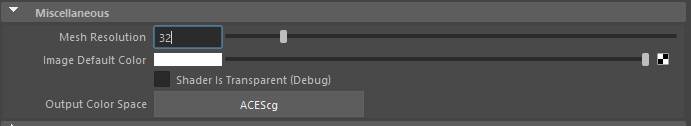
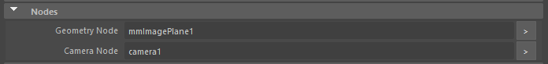
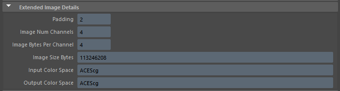

Create Node Tools
=================

.. figure:: images/tools_shelf_icons_creation.png
    :alt: Node Creation Shelf Icons
    :align: center
    :width: 40%

Creating various nodes and objects with mmSolver uses the tools below.

.. _create-marker-ref:

Create Marker
-------------

Create a default `Marker` node under the active viewport's `Camera`.

Usage:

1) Click in a Maya 3D viewport, to activate the `Camera`.

2) Run the `Create Marker` tool, using the shelf, menu or marking menu.

   - A `Marker` will be created in the center of the viewport.

.. note::
    Default Maya cameras (such as ``persp``, ``top``, ``front``, etc)
    are not supported to create Markers.

.. note:: To create Markers, with 2D data from external 3D software
    use the :ref:`Load Markers <load-markers-ref>` tool.

Run this Python command:

.. code:: python

    import mmSolver.tools.createmarker.tool as tool
    tool.main()

.. _create-bundle-ref:

Create Bundle
-------------

Create a default `Bundle` node.

If `Markers` are selected, the `Bundle` will attempt to attach to it,
while adhering to the rule; *a bundle can only have one marker
representation for each camera.*

Run this Python command:

.. code:: python

    import mmSolver.tools.createbundle.tool as tool
    tool.main()

.. _create-line-ref:

Create Line
-----------

Create a 2D `Line` node, made up of `Markers` and `Bundles`. The `Line`
defines a straight line between all `Markers` on the `Line`.

Adjust the Marker positions to move the `Line`.

.. note:: To display a straight line select the ``mmLineShape`` shape
   node and enable `Draw Middle`.

Run this Python command:

.. code:: python

    import mmSolver.tools.createline.tool as tool
    tool.main()

.. _create-camera-ref:

Create Camera
-------------

Create a default Camera.

Run this Python command:

.. code:: python

    import mmSolver.tools.createcamera.tool as tool
    tool.main()

.. _create-lens-ref:

Create Lens
-----------

Create a `Lens` (distortion) node.

The `Lens` node is used to distort all `Markers` attached to the
`Camera` similar to how imperfections in physical lenses distorts
light (mostly at the edges) of an image.

Usage:

1) Activate 3D viewport or select camera node(s).

2) Run the `Create Lens` tool, using the shelf or menu.

3) Adjust lens node attributes as needed, or load a lens with the
   :ref:`Load Markers in Maya <load-markers-in-maya-ref>`.

Run this Python command:

.. code:: python

    import mmSolver.tools.createlens.tool as tool
    tool.main()

.. _create-imageplane-ref:

Create ImagePlane
-----------------

Create a :ref:`MM ImagePlane <imageplane-ref>` node, with the chosen
image file (sequence) used to display a flat plane with an image
texture in the Maya 3D scene.

.. figure:: images/tools_create_mm_image_plane.png
    :alt: MM Image Plane
    :align: center
    :width: 90%

Usage:

1) Activate 3D viewport or select camera node(s).

2) Run the `Create ImagePlane` tool, using the shelf or menu.

3) Browse to image file.

   - If the image is named as an image sequence (such as
     ``file.#.ext``), it will be detected and the full image sequence
     will be loaded.

To create an image plane, you can run this Python command:

.. code:: python

    import mmSolver.tools.createimageplane.tool as tool
    tool.main()

.. _imageplane-ref:

MM ImagePlane
-------------

The `MM ImagePlane` node is an improved Image Plane, designed for
MatchMove tasks, and can be created with the :ref:`Create ImagePlane
<create-imageplane-ref>` tool.

Key features:

- **Multiple Image Slots**; Switch seamlessly between 4 different
  image sequences loaded onto the `MM ImagePlane`.

- **Memory resource control**; The :ref:`Image Cache
  <image-cache-preferences-ref>` is used to limit and detail memory
  usage for the `MM ImagePlane` allowing greater control than the
  native Maya ImagePlane.

- **Real-Time Lens Distortion**; Lenses added to the camera (with
  :ref:`Create Lens <create-lens-ref>` tool) will distort the `MM
  ImagePlane` in real-time as attributes update.

- **Frame Range controls and details**; Override the first frame of an
  image sequence to any other frame, and see the output frame number
  easily for debugging.

- **Enhanced Display controls**; Adjust the exposure, gamma,
  saturation and soft-clip of the input image data, and display
  individual colour channels.

.. _imageplane-display-attributes-ref:

Display Attributes
~~~~~~~~~~~~~~~~~~

.. figure:: images/tools_image_plane_attributes_display.png
    :alt: MM ImagePlane Display attributes.
    :align: center
    :width: 80%

`Display Attributes` control how the `MM ImagePlane` looks in the
viewport; use these attributes to make the image easier to see.

.. list-table:: Display Attributes
   :widths: auto
   :header-rows: 1

   * - Name
     - Description

   * - Visible To Camera Only
     - Description

   * - Gain
     - Description

   * - Exposure
     - Description

   * - Gamma
     - Description

   * - Saturation
     - Description

   * - SoftClip
     - Description

   * - Alpha Gain
     - Description

   * - Input Color Space
     - Description

   * - Image Ignore Alpha
     - Description

   * - Display Channel
     - Description

.. _imageplane-image-sequence-attributes-ref:

Image Sequence Attributes
~~~~~~~~~~~~~~~~~~~~~~~~~

*To be written*

.. list-table:: Image Sequence Attributes
   :widths: auto
   :header-rows: 1

   * - Name
     - Description

   * - Image Sequence Slot
     - Description

   * - Image Sequence (Main)
     - Description

   * - Image Sequence (Alt 1)
     - Description

   * - Image Sequence (Alt 2)
     - Description

   * - Image Sequence (Alt 3)
     - Description

   * - Image Width
     - Description

   * - Image Height
     - Description

   * - Image Pixel Aspect
     - Description

   * - Start Frame
     - Description

   * - End Frame
     - Description

   * - Image Sequence Frame
     - Description

   * - First Frame
     - Description

   * - Frame Output
     - Description

   * - Image Flip (Vertical)
     - Description

   * - Image Flip (Horizontal)
     - Description

.. _imageplane-hud-attributes-ref:

HUD Attributes
~~~~~~~~~~~~~~~~~~~~~~~~~

*To be written*

.. list-table:: HUD Attributes
   :widths: auto
   :header-rows: 1

   * - Name
     - Description

   * - Draw Hud
     - Description

   * - Draw Camera Size
     - Description

   * - Draw Image Size
     - Description

.. _imageplane-image-cache-attributes-ref:

Image Cache Attributes
~~~~~~~~~~~~~~~~~~~~~~

*To be written*

See :ref:`Image Cache Preferences <image-cache-preferences-ref>` for
details on how to control the MM Image Plane hardware resources used.

.. list-table:: Image Cache Attributes
   :widths: auto
   :header-rows: 1

   * - Name
     - Description

   * - Refresh Attribute Editor (button)
     - Description

   * - Image Sequence Size
     - Description

   * - GPU Cache Used
     - Description

   * - CPU Cache Used
     - Description

   * - Total Memory Available
     - Description

   * - Clear... (button)
     - Description

   * - Image Cache Preferences... (button)
     - Open the :ref:`Image Cache Preferences <image-cache-preferences-ref>`.

.. _imageplane-misc-attributes-ref:

Miscellaneous Attributes
~~~~~~~~~~~~~~~~~~~~~~~~

*To be written*

.. list-table:: Miscellaneous Attributes
   :widths: auto
   :header-rows: 1

   * - Name
     - Description

   * - Mesh Resolution
     - Description

   * - Output Color Space
     - Description

.. _imageplane-nodes-attributes-ref:

Nodes Attributes
~~~~~~~~~~~~~~~~

*To be written*

.. list-table:: Nodes Attributes
   :widths: auto
   :header-rows: 1

   * - Name
     - Description

   * - Geometry Node
     - Mostly used for debugging. The connected node used to extract
       mesh geometry for the `MM ImagePlane` to draw on the
       screen. This geometry node may be deformed by lens distortion.

   * - Camera Node
     - Description

.. _imageplane-extended-image-details-attributes-ref:

Extended Image Details Attributes
~~~~~~~~~~~~~~~~~~~~~~~~~~~~~~~~~

*To be written*

.. list-table:: Extended Image Details Attributes
   :widths: auto
   :header-rows: 1

   * - Name
     - Description

   * - Padding
     - Description

   * - Image Num Channels
     - Description

   * - Image Bytes Per Channel
     - Description

   * - Image Size Bytes
     - Description

   * - Input Color Space
     - Description

   * - Output Color Space
     - Description
