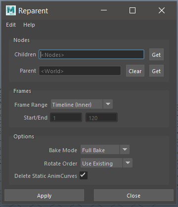
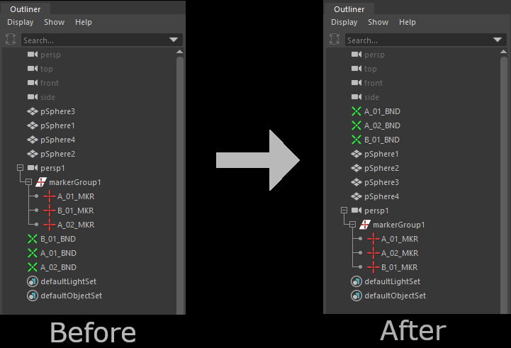
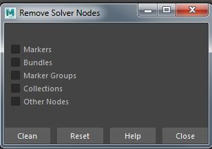
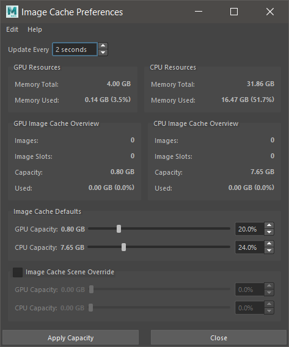
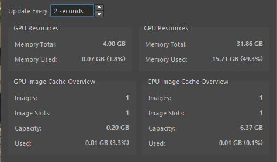
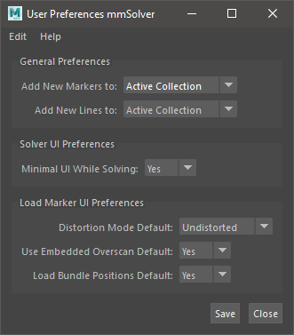

General Tools
=============

The tools on this page are not specific to Markers, Cameras or
Bundles, but are general tools useful in Maya for many different
tasks.

.. _reparent-under-node-tool-ref:

Reparent Under Node
-------------------

This is equivalent to Maya's *Parent* tool (`p` hotkey), except the
tool will maintain the world-space position of the transform node for
each keyframe applied to the node.

See the :ref:`Reparent UI <reparent-window-tool-ref>` for options.

Usage:

1) Select nodes to change parent, then select the new parent node.

   - The first nodes will become the children of the last selected node.

   - The last node is the new parent.

2) Run tool.

   - The first nodes are now parented under the last selected node,
     and will stay in the same position in world-space for all
     keyframes.

To run the tool, use this Python command:

.. code:: python

    import mmSolver.tools.reparent2.tool as tool
    tool.reparent_under_node()

.. _unparent-to-world-tool-ref:

Unparent to World
-----------------

This is equalivent to Maya's *Unparent* tool (`Shift + p` hotkey), except the tool will
maintain the world-space position of the transform node for each
keyframe applied to the node.

See the :ref:`Reparent UI <reparent-window-tool-ref>` for options.

Usage:

1) Select Maya transform node(s).

   - The nodes may be in a deep hierarchy, or not.

2) Run tool.

   - The nodes will maintain the same world-space position, but will
     be unparented into root Maya Outliner (the nodes will not be
     parented under any node).

To run the tool, use this Python command:

.. code:: python

    import mmSolver.tools.reparent2.tool as tool
    tool.unparent_to_world()

.. _reparent-window-tool-ref:

Reparent UI
-----------

This window displays options for how to re-parent nodes.

*Reparent* is the underlying tool window used by both
:ref:`Reparent Under Node <reparent-under-node-tool-ref>`
and :ref:`Unparent to World <unparent-to-world-tool-ref>`.

.. list-table:: Reparent UI Options
   :widths: auto
   :header-rows: 1

   * - Name
     - Values
     - Description

   * - Children
     - *Node Names*
     - Description

   * - Parent
     - *Node Name* or empty
     - The node to place children underneath.

   * - Frame Range
     - *Timeline (Inner)*, *Timeline (Outer)* or *Custom*
     - The frame range to bake.

   * - Bake Mode
     - *Full Bake* or *Smart Bake*
     - Method for how keyframes are baked.

   * - Rotate Order
     - *Use Existing* or *XYZ*, *ZXY*, etc
     - Change the rotation order of children nodes when re-parenting.

   * - Delete Static AnimCurves
     - *Yes* or *No*
     - Baked attributes that do not animate have all keys replaced
       with a static value.

This video tutorial explains how the re-parenting tool works.

.. raw:: html

    <iframe width="720" height="405" src="https://www.youtube.com/embed/UmVu3oag_-k" frameborder="0" allow="accelerometer; autoplay; encrypted-media; gyroscope; picture-in-picture" allowfullscreen></iframe>

To run the tool, use this Python command:

.. code:: python

    import mmSolver.tools.reparent2.tool as tool
    tool.open_window()

.. _create-remove-controller-tool-ref:

Create / Remove Controller
--------------------------

Create a new transform node to control another node. The `Controller`
transform node can have a separate hierarchy than the source node.

The UI for this tool can be used control the baking method, and the
'space' of the created controller. These features create a very
powerful workflow for editing, and solving characters and objects.

.. figure:: images/tools_create_controller_ui.png
    :alt: Create Controller UI
    :align: center
    :width: 60%

.. note:: For a simple, straight-forward tool to create a world-space
    controller for each selected object, use the `Create (World-Space)
    Controllers` tool.

Usage:

1) Select a Maya transform node.

2) Open 'Create Controller' tool UI.

3) Type a name for the controller.

4) Select your `pivot object` and press `Pick Selection`.

5) Select your `main object` and press `Pick Selection`.

6) Select your options for `Type`, `Pivot`, `Bake` mode, and `Space`.

   - Use the `Controller Type` menu to change the node types created
     for the controller. Choose "Group" if you do not like to see
     locators in your viewport.

   - `Pivot` changes how the pivot object is baked; `Static` assumes
     the pivot object does not animate or is baked on the current
     frame. `Dynamic` uses an animated pivot.

   - `Bake` changes the method used to bake keyframe times. Choose
     `Full Bake` to bake every frame, and choose `Smart Bake` to bake
     some frames.

   - `Space` changes the heirachy and orientation of the Controller
     nodes. Using `Screen Space` allows you to move an object in
     screen-space, with X and Y the position on the screen, and Z the
     depth into the screen. This can be very helpful for smoothing
     Z-bumps and depth problems.

7) Press `Create Controller` button.

   - A new `Controller` node is created at the same position as the
     `pick object`.

8) Select and move the created Controller as you wish.

9) Select the Controller, run `Remove Controller` tool.

   - The source node is baked and the Controller node is deleted.

To run the tool, use this Python command:

.. code:: python

    import mmSolver.tools.createcontroller2.tool as tool
    tool.open_window()

To create world-space controllers for the current selection, without
using any of the UI options, use this Python command:

.. code:: python

    import mmSolver.tools.createcontroller2.tool as tool
    tool.create_world_controllers()

To remove a controller, use this Python command:

.. code:: python

    import mmSolver.tools.removecontroller2.tool as tool
    tool.main()

The tool described above is "version 2", for the older (less featured)
version 1, use this python code to run it.

.. code:: python

    import mmSolver.tools.createcontroller.tool as tool

    # Create a Controller
    tool.create()

    # Remove selected Controller
    tool.remove()

.. _create-rivet-tool-ref:

Create Rivet
------------

Create a transform locator node that follows the surface of a Mesh, i.e. the
transform is 'riveted' to the mesh.

There are two types of rivet types currently supported:

 - **Mesh Two Edges** rivets are created from 2 Mesh shape edge
   components, the same as using the classic `rivet.mel`_ script. If
   the topology of the underlying mesh changes, the rivet will move
   across the surface.

 - **Point On Poly Constraint** rivets are created at selected
   vertices and can be moved along the surface with the UV
   coordinates. If the UV coordinates of the underlying mesh changes,
   the rivet may move. This rivet-style will not work with UV
   coordinates outside the regular 0.0 to 1.0 UV space as is commonly
   used with texture UDIMs.

Usage:

1) Select a Maya Mesh components.

   - Select Mesh Vertices to create **Point On Poly Constraint**
     rivets.

   - Select 2 Mesh Edges to create a single **Mesh Two Edges** rivet.

2) Run tool.

   - A rivet locator will be created.

   - For a **Point On Poly Constraint** rivet, you can adjust the `U`
     and `V` coordinates from the rivet locator, if needed.

To run the tool, use this Python command:

.. code:: python

    import mmSolver.tools.createrivet.tool as tool
    tool.main()

.. _rivet.mel:
   https://www.highend3d.com/maya/script/rivet-button-for-maya

.. _create-rivet-tool-ref:

Surface Cluster
---------------

A Surface Cluster is a "cluster" deformer that will be riveted to the
surface of a mesh object. All movement of the underlying surface is
inherited by the Surface Cluster, so the cluster "sits on" the
surface, even if the underlying surface is animated/deformed.

Surface Clusters can be very helpful for subtly adjusting the
silhouette of an object, or adding a bulge, especially when the change
needs to be animated.

.. note:: This old `Surface Cluster YouTube Video`_ shows the general
          usage of the tool, however the tool has been re-written and
          improved with features for editing the deforming weights.

.. _Surface Cluster YouTube Video:
   https://youtu.be/7SFP4TgVbEI

Create Single Surface Cluster
~~~~~~~~~~~~~~~~~~~~~~~~~~~~~

Create a Surface Cluster on the selected Mesh component.

Usage:

1) Select 1 or more components (vertices, edges, faces, etc).

2) Run this tool.

   - create a single surface cluster at the average position of all selected
     components.

   - (Optionally) Use current Soft Selection as default weighting - the
     same as the "update_weights_with_soft_selection" tool.

To run the tool, use this Python command:

.. code:: python

    import mmSolver.tools.surfacecluster.tool as tool
    tool.create_single_surface_cluster()

    # Open the UI window change settings before creation.
    tool.open_window()

Create Multiple Surface Cluster
~~~~~~~~~~~~~~~~~~~~~~~~~~~~~~~

Create multiple surface clusters, one for each component selected.

Usage:

1) Select 1 or more components (vertices, edges, faces, etc).

2) Run this tool.

   - For each component, create a surface cluster is created.

To run the tool, use this Python command:

.. code:: python

    import mmSolver.tools.surfacecluster.tool as tool
    tool.create_multiple_surface_clusters()

    # Open the UI window change settings before creation.
    tool.open_window()

Update Weights With Soft-Selection
~~~~~~~~~~~~~~~~~~~~~~~~~~~~~~~~~~

Update the cluster deformer weights using the current component
soft-selection.

Usage:
1) Enable Soft Selection ('b' hotkey)

2) Select 1 or more components (vertices, edges, faces, etc).

3) Select surface cluster control.

4) Run this tool.

   - The weights of the surface cluster are updated with the soft
     selection.

To run the tool, use this Python command:

.. code:: python

    import mmSolver.tools.surfacecluster.tool as tool
    tool.update_weights_with_soft_selection()

Open Surface Cluster Paint Weights
~~~~~~~~~~~~~~~~~~~~~~~~~~~~~~~~~~

Open the paint weights tool for the selected surface cluster Control.

Usage:
1) Select a surface cluster control.

2) Run tool.

   - The paint weights tool is opened.

3) User paints weights.

To run the tool, use this Python command:

.. code:: python

    import mmSolver.tools.surfacecluster.tool as tool
    tool.open_paint_weights_tool()

.. _marker-bundle-rename-tool-ref:

Marker Bundle Rename
--------------------

Renames selected markers and bundles connected, takes the input name
given in prompt window.

Usage:

1) Select Marker (or Bundle) nodes.

2) Run tool.

   - A prompt is displayed to enter the new name for the Marker and Bundles.

   - If the prompt is left at the default value ``marker``, then the
     Markers will named ``marker`` and Bundles will be named
     ``bundle``.

To run the tool, use this Python command:

.. code:: python

    import mmSolver.tools.markerbundlerename.tool as tool
    tool.main()

.. _marker-bundle-rename-with-metadata-tool-ref:

Marker Bundle Rename (with Metadata)
------------------------------------

Renames the selected Markers and Bundles using only the metadata saved
onto the Marker nodes.

For example, metadata from 3DEqualizer is saved onto the Marker node.

Usage:

1) Select Marker (or Bundle) nodes.

2) Run tool.

   - Markers and Bundles are renamed based on metadata, if metadata is
     not found, the Marker/Bundle is not renamed.

To run the tool, use this Python command:

.. code:: python

    import mmSolver.tools.markerbundlerenamewithmetadata.tool as tool
    tool.main()

.. _sort-selected-nodes-in-outliner-tool-ref:

Sort Selected Nodes In Outliner
-------------------------------

Alphabetically sorts (re-orders) the selected nodes in the Maya Outliner window.

This tool avoids the Maya Outliner window's (interactive) "Sort Order" feature
and encourages an organised workflow when working with many nodes.

This tool works on *any* Transform node, not only mmSolver nodes.

Usage:

1) Select transform nodes.

2) Run tool.

   - The nodes will be sorted.

To run the tool, use this Python command:

.. code:: python

    import mmSolver.tools.sortoutlinernodes.tool as tool
    tool.main()

.. _remove-solver-nodes-tool-ref:

Remove Solver Nodes
-------------------

Remove Solver Nodes tool allows for the removal of
some or all nodes related to the matchmoveSolver
plugin, allowing for a clean scene to be prepped
to passed to other departments/vendors.

Usage:

1) Run tool.

   - A UI will open.

2) Select what type of nodes you wish to remove.

3) Click 'Clean'.

Note that if there are other nodes constrained or
connected in some way to the marker or bundle
nodes they should be cleaned or baked before
removal.

To run the tool, use this Python command:

.. code:: python

    import mmSolver.tools.removesolvernodes.tool as tool
    tool.main()

.. _image-cache-preferences-ref:

Image Cache Preferences
-----------------------

The `Image Cache Preferences` control how much memory `MM Solver` is
allowed to use to store image data, and displays real-time information
about memory consumption of the computer hardware resources; both CPU
and GPU memory.

The :ref:`MM ImagePlane <imageplane-ref>` uses the Image Cache to
store all image data.

The `Image Cache Preferences` have *defaults* and *scene override*
options. The *default* options are used when Maya is started, and new
Maya scenes are created. The *scene override* options are used when
the current Maya scene is opened; these only apply to the current Maya
scene and are useful when you wish to adjust a specific scene with
exceptional requirements without adjusting your regular *default*
options.

.. note:: The `Image Cache Preferences` *only* control the capacity of
          images loaded by `MM Solver`. Other types of data in Maya
          like geometry and material/surface textures are not
          controlled or detailed.

To run the tool, use this Python command:

.. code:: python

    import mmSolver.tools.imagecacheprefs.tool as tool
    tool.open_window()

What Image Cache Values Should I Use?
~~~~~~~~~~~~~~~~~~~~~~~~~~~~~~~~~~~~~

The Image Cache Capacity values are depending on two things; hardware
memory capacity and frame count / image resolution. This section lists
some common wisdom and logic to optimise the use of the `Image Cache`.

The default `Image Cache Preferences` are intended for a user with a
~200 frame 1080p HD shot, 4 GB of GPU memory and 32 GB CPU memory. The
hardware specifications for a professional workstation in 2024 is
expected to surpass these values, but this assumption is intended to
ensure that lower-spec hardware still performs okay.

If you don't care about MM ImagePlane playback speed; set the `Image
Cache` capacity to 0%.

If you want the maximum performance and you have a lot of GPU and CPU
memory, and you only work with one Maya Scene open at once; set the
`Image Cache` capacity to 100%

If you want to fit the image sequence of an `MM ImagePlane`, look at
the `Image Cache` tab in the Attribute Editor, and set your GPU and
CPU `Image Cache` capacity to just above that number.

If you are often running out of GPU memory, decrease your GPU memory
capacity to 0% or the lowest possible - you may get a limited playback
speed (depending on the image resolution), however the Image Cache
will only keep 1 image in GPU memory at any one time - at the cost of
slower playback.

Hardware Resource Monitor
~~~~~~~~~~~~~~~~~~~~~~~~~

The `Image Cache Preferences` window allows users to monitor the
computer's memory resources similar to the `Microsoft Windows` Task
Manager or System Monitors on `Linux`. Additionally the window
provides details of the `Image Cache` memory usage, detailing how many
individual *Images* are stored and how many *Image Slots* (similar to
image sequences) are stored.

.. note:: The `Image Cache` *Capacity* and *Used* values only display
          statistics of memory of the Image Cache; geometry and
          material/shader textures are not counted.

.. list-table:: GPU/CPU Resource Fields
   :widths: auto
   :header-rows: 1

   * - Field
     - Description
     - Measurement Unit

   * - Memory Total
     - Total amount of memory of the hardware resource.
     - Gigabytes (GB)

   * - Memory Used
     - Amount of memory available for the hardware resource.
     - Gigabytes (GB)

.. list-table:: GPU/CPU Image Cache Overview Fields
   :widths: auto
   :header-rows: 1

   * - Field
     - Description
     - Measurement Unit

   * - Images
     - Number of individual images stored in the `Image Cache` on the
       hardware.
     - Count

   * - Image Slots
     - Number of unique image sequences stored in the `Image Cache` on
       the hardware.
     - Count

   * - Capacity
     - Amount of hardware memory allowed to be used for the `Image
       Cache`.
     - Gigabytes (GB)

   * - Used
     - Amount of `Image Cache` capacity used.
     - Gigabytes (GB) / Percentage of Capacity

.. _user-preferences-tool-ref:

User Preferences
----------------

The *User Preferences* window is used to change how mmSolver tools and
general functions behave, by default.

.. list-table:: Options
   :widths: auto
   :header-rows: 1

   * - Name
     - Values
     - Description

   * - Add New Markers to
     - *None* or *Active Collection*
     - When a new Marker is created by any tool, what Collection should
       this Marker be automatically added to?

   * - Add New Lines to
     - *None* or *Active Collection*
     - When a new Line is created by any tool, what Collection should
       this Line be automatically added to?

   * - Minimal UI While Solving
     - *Yes* or *No*
     - If *Yes*, the :ref:`Solver UI <solver-ui-ref>` will only display
       the progress bar while solving, and then switch back to the full
       UI solving has finished. If *No*, the :ref:`Solver UI <solver-ui-ref>`
       will not be adjusted.

   * - Solver Options
     - *Default* or *Developer*
     - If set as *Developer*, the :ref:`Solver UI <solver-ui-ref>`
       will display extended options intended for users testing or
       experimenting with new features, or for developers of
       mmSolver..

   * - Rename Markers Default
     - *Yes* or *No*
     - Controls the default value used for the "Rename Markers" option
       in the :ref:`Load Markers <load-markers-ref>` UI.

   * - Distortion Mode Default
     - *Undistorted* or *Distorted*
     - Controls the default value shown in the :ref:`Load Markers
       <load-markers-ref>` UI.

   * - Use Embedded Overscan Default
     - *Yes* or *No*
     - Controls the default value shown in the :ref:`Load Markers
       <load-markers-ref>` UI.

   * - Load Bundle Positions Default
     - *Yes* or *No*
     - Controls the default value shown in the :ref:`Load Markers
       <load-markers-ref>` UI.

   * - Bundle Space Default
     - *Local-Space* or *World-Space*
     - Controls the default value shown in the :ref:`Load Markers
       <load-markers-ref>` UI.

Usage:

1) Open 'User Preferences' window.

2) Change options.

3) Press "Save" button.

To run the tool, use this Python command:

.. code:: python

    import mmSolver.tools.userprefswindow.tool as tool
    tool.open_window()
