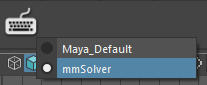
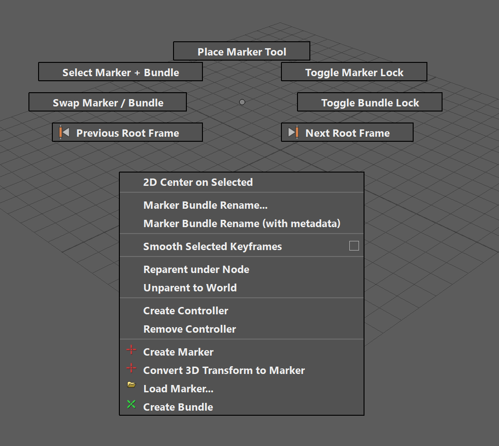

Hotkeys
=======

Define the hotkeys and hotkey related tools for mmSolver.

.. _change-hotkey-set-heading:

Change Hotkey Set
-----------------

On the mmSolver shelf is a dynamic-drop-down menu to quickly switch
the currently active Hotkey Set. This tool will not just work with
mmSolver hotkeys, but instead it will work with all hotkey sets.

While using this tool, the user will not need to open the Maya Hotkey
Editor to change the Hotkey Set.

.. _default-hotkeys-heading:

Default Hotkeys
---------------

Inside the *mmSolver* hotkey set there are default hotkeys. The
default hotkeys are provided as helping shortcuts to speed up the
workflow with mmSolver. The user may change the hotkeys using Maya's
native Hotkey tools, see
:ref:`Customising Default Hotkeys <customising-default-hotkeys-heading>`
for more information.

The **A** key invokes a catch-all tool capable of performing many
common tasks without needing to move your mouse away from the
viewport.

.. list-table:: List of default hotkeys
   :widths: auto
   :header-rows: 1

   * - Key
     - Description
     - Link

   * - Press **C** key
     - Center 2D on Selected
     - :ref:`Link <center-2d-on-selection-tool-ref>`

   * - Press **Z** key
     - Zoom / Pan tool (the same one with Maya)
     - `Maya Zoom Pan tool`_

   * - Press **M** key
     - Swap Marker / Bundle Selection
     - :ref:`Link <toggle-marker-bundle-selection-tool-ref>`

   * - Press **N** key
     - Select both Markers and Bundles
     - :ref:`Link <select-marker-and-bundle-tool-ref>`

   * - Press **D** key
     - Toggle Screen-Z Manipulator
     - :ref:`Link <screen-z-manipulator-tool-ref>`

   * - Press **T** key
     - Activate Place Marker tool, click and drag to move the selected Marker.
     - :ref:`Link <place-marker-manipulator-tool-ref>`

   * - Hold-down **A** key
     - Activate the mmSolver Marking Menu (see below).
     - :ref:`Link <marking-menu-heading>`

   * - Press **CTRL + P** key
     - Parent under Node tool.
     - :ref:`Link <reparent-under-node-tool-ref>`

   * - Press **CTRL + SHIFT + P** key
     - Unparent to World tool.
     - :ref:`Link <unparent-to-world-tool-ref>`

   * - Press **ALT + P** key
     - Project Markers on Mesh
     - :ref:`Link <project-marker-on-mesh-tool-ref>`

   * - Press **ALT + 1** key
     - Show/Hide geometry in the current viewport.
     - :ref:`Link <toggle-viewport-node-types-ref>`

   * - Press **ALT + 2** key
     - Show/Hide Markers, Bundles, Locators and NURBS Curves in the
       current viewport.
     - :ref:`Link <toggle-viewport-node-types-ref>`

   * - Press **ALT + 3** key
     - Show/Hide Image Planes in the current viewport.
     - :ref:`Link <toggle-viewport-node-types-ref>`

   * - Press **` (backtick)** key
     - Cycle Viewport Display Preset *forward*.
     - :ref:`Link <cycle-viewport-display-preset-tool-ref>`

   * - Press **ATL + ` (backtick)** key
     - Cycle Viewport Display Preset *forward*.
     - :ref:`Link <cycle-viewport-display-preset-tool-ref>`

.. _marking-menu-heading:

Marking Menu
------------

Along with the default hotkey set, a Maya Marking Menu has been
created with many common tools in a simple to use menu.

.. _customising-default-hotkeys-heading:

Customising Default Hotkeys
---------------------------

The default *mmSolver* hotkeys can be edited using Maya's native Hotkey
configuration tools.

The steps below will explain how to create a new Maya Hotkey Set that
will extend the mmSolver hotkeys. The same steps can be used to extend
the default Maya hotkeys.

#. Open Maya.
#. Open the Hotkey Editor with the menu `Windows > Settings / Preferences
   > Hotkey Editor`
#. Choose the Hotkey Set to be extended from the drop-down.
#. Click the Gear settings icon next the Hotkey Set drop-down and
   select "Duplicate...".

   #. Enter the name of your custom Hotkey Set to be created.

#. Edit the hotkeys using the Hotkey Editor.
#. Press *Save and Close* button.
#. Use the :ref:`Change Hotkey Set <change-hotkey-set-heading>` button
   on the `mmSolver` shelf to change the active Hotkey Set.

.. _Maya Zoom Pan tool:
   https://knowledge.autodesk.com/support/maya-lt/learn-explore/caas/CloudHelp/cloudhelp/2019/ENU/MayaLT-TextureBaking/files/GUID-A7CAE8D4-B3B0-4FF8-8405-4DF3427A8DB8-htm.html
