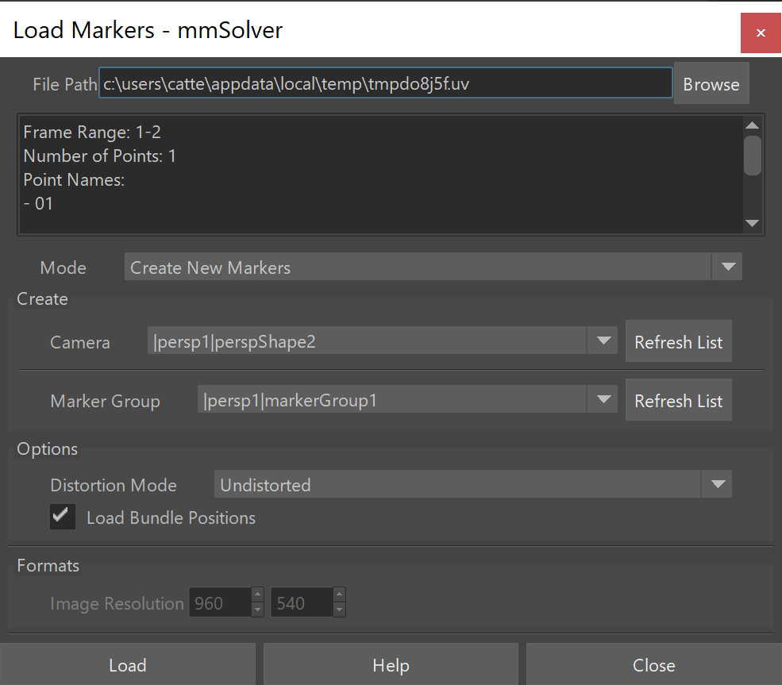
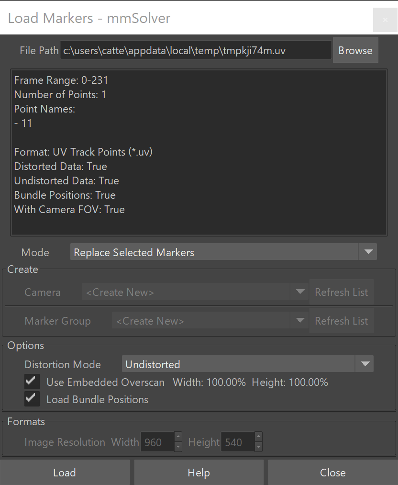

Input/Output Tools
==================

The tools on this page are used to import and export data from Maya
using `MM Solver`.

.. _load-markers-ref:

Load Markers
------------

    Load Markers UI

The Load Markers UI allows loading of ``.uv`` (mmSolver), ``.txt``
(3DEqualizer4), ``.rz2`` (Autodesk MatchMover), ``.txt / .2dt``
(PFTrack) formatted files.

When opening the UI, the contents of the user’s clipboard is
queried. If the clipboard is a valid file path, it will be
automatically pasted into the “File Path”, so you won’t need to
“Browse” for the file.

In 3DEqualizer, the ``Copy 2D Tracks (MM Solver)`` is used to copy
the selected 2D points to a temporary file path and then place that
file path on the clipboard automatically. Once the file path is on the
clipboard, open the Maya Load Marker tool and the path will be
read automatically.

In Blender the ``Motion Clip Editor`` sidebar contains a ``MM Solver``
panel, with a Copy and Export 2D Tracks tool.

The ``Camera`` list contains all the cameras currently in the Maya
scene. If no cameras are available (persp, front, top, left do not
count), the default option is to create a new camera. The ``Update``
button refreshes the ``Camera`` list without needing to close and
re-open the UI.

For 3DEqualizer ``.txt`` and PFTrack ``.txt / .2dt`` formats you will
need to enter the Width / Height of the input format.

Once a file path is given, press the ``Load`` button.

Run this Python command:

.. code:: python

    import mmSolver.tools.loadmarker.ui.loadmarker_window as tool
    tool.main()

.. _copy-3de4-2d-tracks-ref:

Copy 2D Tracks from 3DEqualizer
+++++++++++++++++++++++++++++++

.. figure:: images/tools_loadmarker_tde_copyTracks.png
    :alt: Copy a 2D Track in 3DE
    :align: right
    :scale: 20%

To create a ``.uv`` file, you may use the 3DEqualizer ``Copy 2D Tracks
(MM Solver)`` script (see mmSolver installation to install this
script).

The ``Copy 2D Tracks (MM Solver)`` is almost identical to the ``Export
2D Tracks (MM Solver)`` tool. The ``Copy 2D Tracks (MM Solver)`` tool
will perform run the Export tool with default UI values, save the
contents a temporary file, and set the OS Copy/Paste buffer to the
saved file path.

1) In 3DEqualizer, select a 2D Point in the Object or Point Browser.

2) Right-click the point and run ``Copy 2D Tracks (MM Solver)``.

   - A ``.uv`` file will be saved into a temporary file, and the file
     path will be on your system copy/paste clipboard, ready to be used in
     Maya.

3) Next Open Maya and use the file path in the Load Markers UI.

See the video tutorial
`Using 3DEqualizer with mmSolver - Copy 2D Tracks <https://david-cattermole.github.io/mayaMatchMoveSolver/tutorial.html#using-3dequalizer-with-mmsolver-copy-2d-tracks>`_
for a step-by-step example of the tool.

.. _track-2d-rolling-shutter-correct-ref:

2D Tracks Rolling Shutter Correction
++++++++++++++++++++++++++++++++++++

In 3DEqualizer4 with a Rolling Shutter (RS) enabled camera, the ``Copy 2D
Tracks (MM Solver)`` and ``Export 2D Tracks (MM Solver)`` (version
v1.8+) tools will export the 2D data with RS correction.

When exporting RS in 3DEqualizer4 Release 6, the ``(Visualisation
Only) Content Distance`` camera parameter is used for the RS
correction calculation.

In 3DEqualizer4 Release 5 and below, the ``Content Distance`` defaults
to ``100`` units. In 3DEqualizer4 Release 2 and above, to change the
default ``Content Distance`` you can add a special tag to the Project
Notes.  On a new line, type ``RS Content Distance = 42.0`` (with your
choice of number) into the Attribute Editor's Project tab, Project
Notes field. This value will be remembered as your preference for the
current 3DEqualizer scene file.

To automatically set the Project Notes with ``RS Content Distance =
42.0`` you may optionally use the ``Export 2D Tracks (MM Solver)``
tool with a ``Content Distance`` value of choice which will be saved
into Project Notes and remembered.

.. note::

   To export 2D Tracks with RS correction with 3DEqualizer4 Release 1
   or 2, it is recommend to use ``Export 2D Tracks (MM Solver)``,
   because the ``Copy 2D Tracks (MM Solver)`` tool can only export
   with the default ``Content Distance`` of ``100`` units.

.. _copy-blender-2d-tracks-ref:

Copy 2D Tracks from Blender
+++++++++++++++++++++++++++

It is possible to use Blender (v2.80+) to track 2D Markers for use in mmSolver.

1) Install the ``mmSolver_blender_addon.zip`` add-on file from the
   ``blender`` directory of the MM Solver download.

   Simply open the Addons preferences; "Edit > Preferences > Add-ons",
   click "Install..." and browse to the ``mmSolver_blender_addon.zip``.

   See the `Blender Addons documentation <https://docs.blender.org/manual/en/latest/editors/preferences/addons.html>`_.

2) In Blender, open the ``Motion Clip Editor`` and make sure the
   ``(right-side) Sidebar > Footage > Start Frame`` value is set to
   the first frame number in the image sequence you will track.

   For example, if the file of your image sequence is
   ``image.1001.jpg``, use a Start Frame number of 1001.

   This is important because all mmSolver importers and exporters will
   assume the alignment of the 2D Tracking numbers to the the frame
   range of the tracked image sequence.

3) In the ``Motion Clip Editor``, track 2D points as needed using
   Blenders 2D tracking tool set.

4) Select the 2D Track points you wish to copy/export.

5) Go to the ``Motion Clip Editor > (right-side) Sidebar > Track > MM Solver``
   panel, then click ``Copy 2D Tracks``.

   This will export the selected 2D tracks to a temporary .uv file
   and then save the file path on your copy-paste buffer
   (ready for "CTRL + V").

6) Open Maya, and open the ``Load Marker`` tool
   (menu ``mmSolver > Load Marker...``), and press ``Load``.

   For more details, see :ref:`Load Markers in Maya <load-markers-in-maya-ref>`.

   Alternatively you can load the generated ``.uv`` file into
   3DEqualizer using the ``Import Tracks (MM Solver)`` tool provided
   with mmSolver.

.. note::

    When loading 2D Tracks from Blender, change the ``Distortion
    Mode`` to ``distort``, because Blender does not support
    undistorting 2D tracks.

.. note::

   There are some important limitations in the add-on provided.

   - Cameras cannot have animated focal lengths inside the Motion Clip Editor.
     Therefore it is recommended not to use the "overscan" feature of the
     ``Load Marker`` tool in Maya.

   - There is no Python function to undistort 2D data. Therefore when
     tracking with Blender you must solve for lens distortion inside
     mmSolver and use the MM Image Plane to preview lens
     (un)distortion.

.. note::

    Blender versions 2.83.18 LTS, 2.93.6 LTS, and v3.0.0 are known to
    work, other Blender versions with-in the same minor release will
    likely work, but have not been tested.

.. _load-markers-in-maya-ref:

Loading Markers in Maya
+++++++++++++++++++++++

Loading Markers into Maya from external Tracking software is a common
task needed for solving 3D objects and cameras.

1) Open the Load Marker UI, for example use the menu ``mmSolver > Load
   Marker...``.

   - If you already have a valid file path on your Copy/Paste
     Clipboard, then the Load Marker UI will auto-load the file path.

   - The file contents will be displayed below the file path.

2) Choose your options.

3) Press the **Load** button.

When the **Load** button is run, the options used in the Load Marker UI
will be saved to the user's home directory. The saved options are
automatically restored when the Load Marker UI is re-opened.

.. list-table:: Load Marker Options
   :widths: auto
   :header-rows: 1

   * - Option
     - Description

   * - Mode
     - allows you to create new Markers or replace data on selected
       Markers.

   * - Rename Markers
     - will run the :ref:`Marker Bundle Rename
       <marker-bundle-rename-tool-ref>` tool on the loaded markers
       with the given name.

   * - Camera
     - is the camera node you wish to place the newly created Markers
       under. You may also create a new camera node.

   * - Marker Group
     - is the Marker Group (under the **Camera**) that you wish to
       create the Markers underneath. You may create a new Marker
       Group, using the ``<Create New>`` option.

   * - Distortion Mode
     - will allow choosing the type of 2D point data to create or
       load. Some formats (for example ``.uv``) can store both
       undistorted and distorted 2D data.

   * - Use Embedded Overscan
     - will use the camera field of view (FOV) embedded inside the
       file to automatically calculate the correct 2D
       position. ``.uv`` is the only currently supported format. Use
       ``Copy Tracks (MM Solver)`` or ``Export Tracks (MM Solver)``
       version 1.7+ inside 3DEqualizer for this feature to be enabled.

   * - Load Bundle Positions
     - will allow loading 3D point information saved along with the 2D
       Marker data. Only some formats (for example ``.uv``) can store
       both 2D and 3D data in one file.

   * - Bundle Space
     - sets which space to set Bundle positions in; ``Local-Space`` or
       ``World-Space``. Starting with mmSolver v0.5.3, Bundles are
       loaded in ``World-Space`` by default.

   * - Image Resolution
     - is for use with 3DEqualizer4 ``.txt`` or PFTrack ``.txt /
       .2dt`` files, which are stored with plate resolution embedded
       into the 2D data. Use this field to choose the correct plate
       resolution for the 2D data that was exported.

.. _update-markers-in-maya-ref:

Updating / Replacing Markers in Maya
++++++++++++++++++++++++++++++++++++

    Replace the selected Marker nodes.

Marker nodes in Maya can be overwritten with newly tracked data.

1) Open the Load Marker UI.

2) Set the **File Path** for the UI.

3) Change **Mode** to *Replace Selected Markers*.

4) Select Marker nodes using the Maya Outliner.

5) Press **Load** button.

   The Selected Markers will be considered for update.

   If you have select one Marker node, and the loaded file contains
   one 2D Track, then the 2D Track data will overwrite the selected
   Marker node.

   If you have multiple Marker nodes, selected then the Load Marker
   tool will try to match the pre-existing Marker name or metadata
   with the 2D Tracking data in the file. When using 3DEqualizer the
   2D Tracking data is loaded onto the Marker node that was already
   loaded using 3DEqualizer - there is a link between the 2D data in
   3DEqualizer and the Marker node in Maya.

.. _save-marker-tool-ref:

Save Marker
-----------

Saves 2D `Markers` into a ``.uv`` file that can be loaded into `MM
Solver` (or any other software that supports the `MM Solver .uv`
format).

Usage:

1) Select `Marker` nodes.

2) Run tool.

   - Browse with the Save dialog UI presented.

To run the tool, use this Python command:

.. code:: python

    import mmSolver.tools.savemarkerfile.tool as tool
    tool.main()

.. _copy-marker-to-clipboard-tool-ref:

Copy Marker to Clipboard
------------------------

Saves the selected `Marker` node into a temporary file and saves the
file path onto the OS Copy/Paste clipboard.

Usage:

1) Select a Maya `Marker` node.

2) Run tool.

   - Open software or tool supporting loading Markers in ``.uv``
     format, such as the :ref:`Load Markers <load-markers-ref>` tool.

To run the tool, use this Python command:

.. code:: python

    import mmSolver.tools.copypastemarker.tool as tool
    tool.main()

.. _copy-camera-to-clipboard-tool-ref:

Copy Camera to Clipboard
------------------------

Saves the selected camera node into a temporary file and saves the
file path onto the OS Copy/Paste clipboard.

Usage:

1) Select a Maya camera.

2) Run tool.

3) Open 3DEqualizer.

4) Select Camera in Object Browser.

5) Right-click and run ``Paste Camera (MM Solver)...``.

To run the tool, use this Python command:

.. code:: python

    import mmSolver.tools.copypastecamera.tool as tool
    tool.main()

.. _load-lens-tool-ref:

Load Lens File On Selected Nodes
--------------------------------

Load the attributes of a `Lens` using a ``.nk`` file. Files supporting
static and animated values is supported.

The ``.nk`` files given to `MM Solver` are expected to be saved with
the :ref:`Save Lens File <save-lens-tool-ref>` tool or saved with the
`3DEqualizer Export Nuke Lens Distortion` tool.

Usage:

1) Select `Lens` node.

2) Run tool, a browse dialog UI will be displayed.

3) Browse to a file and press "Open".

   - The file will be read and values will be set on the `Lens` node.

To run the tool, use this Python command:

.. code:: python

    import mmSolver.tools.loadlens.tool as tool
    tool.main()

.. _save-lens-tool-ref:

Save Lens File
--------------

Save the values on a `Lens` node into a ``.nk`` file. Both static and
animated attributes are saved.

Usage:

1) Select `Lens` node.

2) Run tool, a browse dialog UI will be displayed.

3) Browse to a file and press "Save".

   - The node values will written to the file.

To run the tool, use this Python command:

.. code:: python

    import mmSolver.tools.savelensfile.tool as tool
    tool.main()
