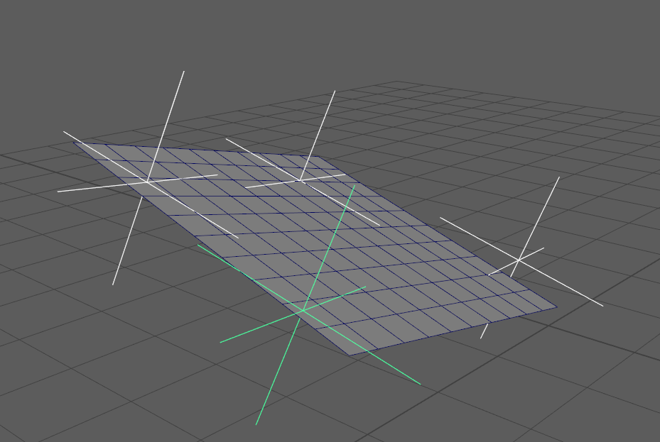
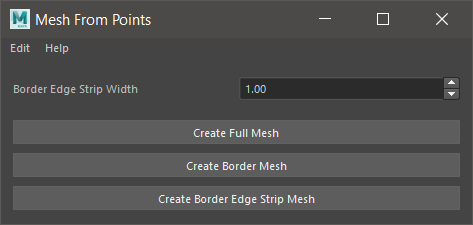

Mesh Tools
==========

Mesh tools will create, modify or operate on meshes. These tools are
intended to augment Autodesk Maya's existing modeling tool-set and be
specific to the common use cases for MatchMove tasks.

.. _create-plane-from-points-ref:

Create Aligned Plane From Points
------------------------

The `Create Aligned Plane From Points` tool is used to generate a Maya
Mesh Plane aligned to a set of 3D points. The plane can be used as a
ground plane, a wall or the beginnings of a 3D terrain.

The aligned plane transform can also be used to re-orient a MatchMove
camera by :ref:`Reparenting <reparent-under-node-tool-ref>` your
camera under the generated Mesh plane, and then zeroing the
translations and rotations of the plane.

reparent-under-node-tool-ref

Usage:

1) Select transform nodes.

   - At least 3 transform nodes are required.

2) Run `Create Aligned Plane From Points` tool.

   - A new "alignedPlane" node transform node will be selected.

To run the tool, use this Python command:

.. code:: python

    import mmSolver.tools.createplanefrompoints.tool as tool
    tool.main()

.. _mesh-from-points-ref:

Mesh From Points
----------------

The `Mesh From Points` tool is used to generate a triangulated mesh
from a set of 3D points. The generated mesh is extremely helpful to
create a 3D visualisation, or as a starting point for a refined
hand-generated model.

`Mesh From Points` uses a type of `Delaunay Triangulation
<https://en.wikipedia.org/wiki/Delaunay_triangulation>`_ named
`Delaunator <https://github.com/mapbox/delaunator>`_, which is
optimised to generate meshes for landscape meshes. As a result, the 3D
points are expected to mostly lay in 2D axis plane (but the plane may
be at any orientation).

.. note:: September, 2024; The Mesh From Points tools cannot be undone.
          This is intended to be fixed in a future release.

Usage:

1) Select transform nodes.

   - At least 3 transform nodes are required.

2) Run `Create Full Mesh From Points` tool.

   - Optionally, use the `Create Border Mesh From Points` or open the
     `Mesh From Points` UI.

   - The `Create Border Edge Strip Mesh` button in the `Mesh From
     Points` can be used create a mesh with extra geometry at the
     edges. This is intended to be used to create a "patch" of
     geometry that can be adjusted further using Maya's modelling
     tools. Adjust the `Border Edge Strip Width` slider to adjust the
     position of the edges.

To create a mesh from the selected nodes, use this Python command:

.. code:: python

    import mmSolver.tools.meshfrompoints.tool as tool
    tool.create_full_mesh()

    # Or create the border mesh only.
    tool.create_border_mesh()

To open the window, use this Python command:

.. code:: python

    import mmSolver.tools.meshfrompoints.tool as tool
    tool.main()
