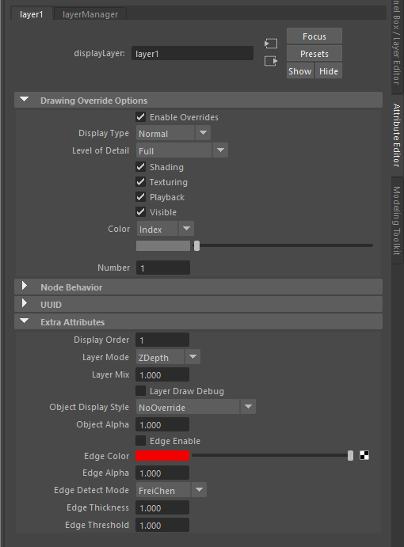

.. _renderer-ref:

MM Renderer
===========

`MM Renderer` is a Viewport 2.0 renderer designed to add helpful
features for use with MatchMove workflows and reviews.

This tool is currently only in beta, and is not enabled in stable `MM
Solver` releases.

.. figure:: images/tools_renderer_menu.png
    :alt: Viewport Renderer menu
    :align: center
    :scale: 80%

    Enable `MM Renderer` in the "Renderer" menu on each Viewport.

`MM Renderer` is different from regular Viewport 2.0 because it has
the following features:

- 2D Composite objects in "layers" to force objects in front/behind
  others.
- Show silhouettes/edges for objects.
- Supports `Hidden Line` rendering, without needing to enable `Hold
  Out` toggles or assign a ``useBackground`` shader.

Getting Started
~~~~~~~~~~~~~~~

1) Load mmSolver plug-in.

   To use `MM Renderer`, simply load the ``mmSolver`` plug-in (for
   example open the Solver UI to ensure the plug-in is loaded), then
   use the Viewport's "Renderer" menu to switch to ``MM Renderer
   (beta)``.

2) Add objects into Display Layers.

   Initially you'll likely find all objects are invisible(!), however
   that's just a small-ish bug, and you'll simply need to add your
   objects to a Maya Display Layer to see them.

3) Adjust Display Layer attributes.

   Once your objects are in a Display Layer you can use the Display
   Layer's "Extra Attributes" in the Attribute Editor to control
   specific options for how the objects in each layer are displayed.

Display Layers
~~~~~~~~~~~~~~

Display Layers can be used to add custom attributes (recognized only
by `MM Renderer`) that can customize the display of the objects.

Using these attributes you can:

- Control how different Display Layers are merged together - like in a
  layer-based composting software (eg Photoshop).
- For a specific display mode (Shaded, Wireframe, Hidden Line, etc)
- Toggle display of object edges.
- Control the alpha of different effects (Layer Mix mode, Objects and Edges)

Display Layer Attributes
++++++++++++++++++++++++

Each Display Layer can have attributes that change how the display
layer is rendered and composited by `MM Renderer`. These attributes
are used to add extra functionality and lock Display Layers to
specific modes, independent of the `Viewport 2.0` settings (such as
`Display Mode` - Shaded, Wireframe, etc).

.. list-table:: Display Layer Attributes
   :widths: auto
   :header-rows: 1

   * - Attribute
     - Description

   * - Layer Mode
     - How will the layer be merged with layers below it? Similar to
       Photoshop layer modes.

   * - Layer Mix
     - Adjust the opacity of the layer - mixing between the layer
       below and this layer.

   * - Object Display Style
     - How will the object in the layer be displayed? Wireframe,
       Hidden Line, Shaded, etc?

   * - Object Alpha
     - Fade the rendered objects as an image - this is *not* object
       transparency.

   * - Edge Enable
     - Toggle edge/silhouette rendering for the objects.

   * - Edge Color
     - The color of the rendered edge?

   * - Edge Alpha
     - Fade the edges to control the bright and transparent they look.

   * - Edge Detect Mode
     - Different algorithms of (2D) edge detection produce subtly
       different styles of lines. Use this option to control subtle
       details of the edge detection look.

   * - Edge Thickness
     - How thick will the edges be? Larger values produce thicker
       lines, but might take longer to render (lower FPS of
       viewport). Smaller thick values run the risk of missing edge
       details.

   * - Edge Threshold
     - An overall control of the edge detection threshold, any
       detected over the threshold will be rendered with the Edge
       Color. This value multiplies the fine-grain edge threshold
       values.

   * - Edge Threshold (Normals)
     - Provides fine-grain control over the detection of edges,
       adjusting how much the object `normals` are used for detecting
       edges.

   * - Edge Threshold (Facing Ratio)
     - Provides fine-grain control over the detection of edges,
       adjusting how much the object `facing ratio` is used for
       detecting edges.

   * - Edge Threshold (Z-Depth)
     - Provides fine-grain control over the detection of edges,
       adjusting how much the object `Z-depth` is used for
       detecting edges.

Known Issues
~~~~~~~~~~~~

`MM Renderer` is *beta* software and is currently only released in
``v0.4.4.beta*``. There are numerous bugs and issues that are not yet
resolved and the viewport renderer is available as a preview only.

.. note::

   ``OpenGL - Core Profile`` is the only supported Rendering Engine -
   you will not see any viewport if you are not using a ``OpenGL -
   Core Profile`` mode. Other Rendering Engines, such as ``OpenGL -
   Legacy`` and ``DirectX 11`` are not supported.

   ``OpenGL - Core Profile`` is the default Rendering Engine in all
   (recent) versions of Maya.

   You can check, and change, your Rendering Engine in the Maya
   Preferences window, by going to the menu ``Windows >
   Settings/Preferences > Preferences``, then click on the ``Display``
   category, and see the `Viewport 2.0` Rendering Engine option at the
   bottom of the Preferences window.

Attributes Missing From Display Layers
++++++++++++++++++++++++++++++++++++++

Display Layers may not have MM Renderer attributes added.

In this beta release Display Layers will have attributes automatically
added when the viewport renderer is toggled.

*Workaround:* Set your viewport renderer to Viewport 2.0, then back to
"MM Renderer (beta)".

This will be fixed in a later release.

The Maya HUD is not displayed
+++++++++++++++++++++++++++++

This will be fixed in a later release.

Slow Viewport Frame Rate
++++++++++++++++++++++++

Performance with many objects and/or Display Layers will reduce the
speed of the viewport.

This will be fixed in a later release.

Wireframes Are Shown in "Edges"
+++++++++++++++++++++++++++++++

On `Maya 2022.0`, you may have some incorrect visuals.

*Workaround:* Upgrade to at least Maya 2022.1+.

Python Function
~~~~~~~~~~~~~~~

The commands below are available for this tool, and allow hotkeys or
custom buttons to be created.

Add `MM Renderer` custom attributes to selected displayLayer nodes:

.. code:: python

    import mmSolver.tools.mmrendererlayers.tool as tool
    tool.main()

Add `MM Renderer` custom attributes to all displayLayer nodes in the current Maya scene:

.. code:: python

    import mmSolver.tools.mmrendererlayers.tool as tool
    setup_all_layers.main()
