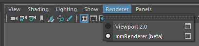
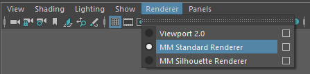
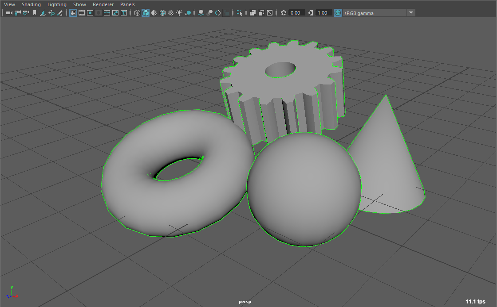
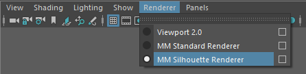

.. _renderer-ref:

Viewport Renderers
==================

`MM Solver` comes with specialised Viewport 2.0 renderers designed to
add helpful features for use with MatchMove workflows and reviews.

    Viewport 2.0 "Renderer" menu.

Currently the following Viewport 2.0 renderers are available.

.. list-table:: MM Solver Renderers
   :widths: auto
   :header-rows: 1

   * - Name
     - Description

   * - :ref:`MM Standard Renderer <renderer-standard-ref>`
     - Identical to default "Viewport 2.0", but correctly works with
       `MM ImagePlane` nodes in from hold-outs, either using Hold Out
       attributes or `Use Background` shaders.

   * - :ref:`MM Silhouette Renderer <renderer-silhouette-ref>`
     - Identical to `MM Standard Renderer`, but adds a silhouette
       outline edge to all rendered meshes in the viewport.

.. _renderer-standard-ref:

MM Standard Renderer
====================

`MM Standard Renderer` is a Viewport 2.0 renderer designed to add
helpful features for use with MatchMove workflows and reviews.

`MM Standard Renderer` is different from regular Viewport 2.0 because
it can display `MM Image Plane` nodes with native `useBackground`
shaders (or Hold-Out geometry).

Usage
~~~~~

1) To use `MM Standard Renderer`, load the ``mmSolver`` plug-in (for
example open the Solver UI to ensure the plug-in is loaded), then use
the Viewport's "Renderer" menu to switch to ``MM Standard Renderer``.

    Enable `MM Standard Renderer` in the Viewport "Renderer" menu.

2) Use the Maya viewport and playblast as normal.

.. _renderer-silhouette-ref:

MM Silhouette Renderer
======================

The `MM Silhouette Renderer` is used to add silhouette outline edge to
rendered geometry, allowing the artist to clearly see the edges of a
mesh against an image sequence.

This rendering effect is particularly effective when the geometry
contains a Hold-Out effect using a `useBackground` shader or hold-out
attributes (see :ref:`Set Mesh Hold-Out <set-mesh-hold-outs-ref>`
tool).

    Example green silhouette effect on shaded objects.

.. note:: `MM Silhouette Renderer` requires the use of the OpenGL
          graphics API backend; DirectX is not supported.

Usage
~~~~~

1) To use `MM Silhouette Renderer`, load the ``mmSolver`` plug-in (for
example open the Solver UI to ensure the plug-in is loaded), then use
the Viewport's "Renderer" menu to switch to ``MM Silhouette
Renderer``.

    Enable `MM Silhouette Renderer` in the Viewport "Renderer" menu.

2) Click viewport panel menu "Renderer > MM Silhouette Renderer
   [Option Box]" to open the :ref:`renderer settings
   <renderer-silhouette-settings-ref>` in the Attribute Editor.

3) Adjust Silhouette settings as needed for desired effect.

4) Use the Maya viewport and playblast as normal.

.. _renderer-silhouette-settings-ref:

Settings
~~~~~~~~

The settings for the `MM Silhouette Renderer` affect all open viewport
panels using the same renderer and allow adjusting the silhouette
effect, including the color and opacity.

.. figure:: images/tools_renderer_globals_silhouette.png
    :alt: The global settings for the `MM Silhouette Renderer` in the
          Attribute Editor.
    :align: center
    :scale: 80%

    The global settings for the `MM Silhouette Renderer` in the
    Attribute Editor.

.. list-table:: MM Silhouette Renderer Settings
   :widths: auto
   :header-rows: 1

   * - Name
     - Description

   * - Depth Offset
     - The separation between the invisible solid geometry and the
       wireframe mesh. Adjust to lower values if small-mesh artifacts
       are visible. Set to ``0.0`` to create a shaded wireframe
       effect.

   * - Width
     - The width of the silhouette lines.

   * - Override Color
     - When enabled, all objects will use the silhouette color
       below. When disabled, the wireframe color of the object is used
       for each object's lines.

   * - Color
     - The override color for silhouette lines.

   * - Alpha
     - The global opacity of the silhouette lines.

   * - Cull Face
     - Backface culling for solid invisible mesh surfaces. For meshes
       with inverted normals values other than ``Back``; Options are
       ``Back``, ``Front`` or ``FrontAndBack``.

   * - (debug) Enable
     - Toggle the silhouette effect on/off.

   * - (debug) Operation Number
     - Used internally to draw only the first N number of rendering
       operations inside the renderer.
