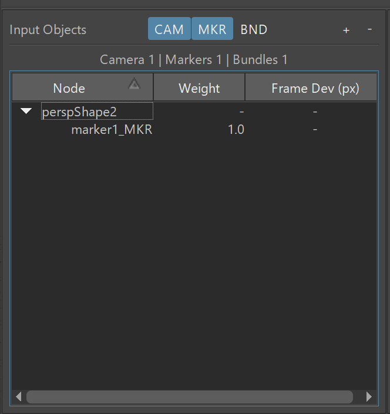
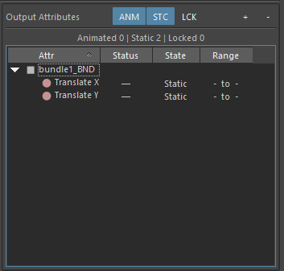
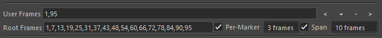
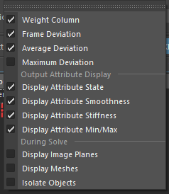

.. _solver-ui-ref:

Solver UI
=========

The Solver UI is the primary interface to using the internal solver
command (`mmSolver`).

.. figure:: images/tools_solver_ui_overview.png
    :alt: Solver User Interface
    :align: center
    :scale: 80%

    Solver User Interface

The shelf tools will open or run the solver.

.. figure:: images/tools_shelf_icons_solver.png
    :alt: Node Solver Shelf Icons
    :align: center
    :width: 30%

Input Objects
~~~~~~~~~~~~~

The Objects are the inputs to the current Solve. This will display
of Markers used for detecting deviation.
To display the Markers, and the related objects, you may turn on/off
the ``CAM``, ``MKR``, ``LN`` and ``BND`` buttons.

There are various columns showing attributes of the input Objects.
To display the column visibility, use the Edit menu.

.. list-table:: Input Object Fields
   :widths: auto
   :header-rows: 1

   * - Field
     - Description

   * - Node
     - The input Object's Node.

   * - Weight
     - The weight the Marker will have in the solver. Higher values
       give an importance to this Marker, at the expense of other
       Markers.

   * - Frame Deviation
     - The deviation, in pixels, of the Marker on the current frame.

   * - Average Deviation
     - The average deviation, in pixels, of the Marker across all
       valid frames.

   * - Maximum Deviation
     - The maximum deviation and frame number on the Marker.

Output Attributes
~~~~~~~~~~~~~~~~~

This section of the UI shows the Attributes solved.

.. list-table:: Output Object Fields
   :widths: auto
   :header-rows: 1

   * - Field
     - Description

   * - Attr
     - The ``Attribute`` column displays nodes and attributes added
       into the active Collection.

   * - State
     - The State column displays if the attribute is Static or
       Animated.

Solver Tabs
~~~~~~~~~~~

The Solver tabs define the different solvers and the options for each
solver. The different solvers tabs share
:ref:`solver-ui-common-solver-options-ref`, such as frame range, but
each Solver tab is independent.

The documentation for each Solver tab is below.

.. toctree::
    :maxdepth: 2

    tools_solver_ui_tab_basic
    tools_solver_ui_tab_standard
    tools_solver_ui_tab_camera

.. _solver-ui-common-solver-options-ref:

Common Solver Options
~~~~~~~~~~~~~~~~~~~~~

The options below are the same on one or many of the Solver tabs.

Frames
++++++

The Frames option defines the list of frames to be solved.

.. figure:: images/tools_solver_ui_solver_options_frames.png
    :alt: Solver Frame Options
    :align: center
    :scale: 100%

Choose one of the options:

.. list-table:: Frames
   :widths: auto
   :header-rows: 1

   * - Option
     - Description

   * - Current Frame
     - Use the current Maya frame number to solve.

   * - Timeline (Inner)
     - Use the frame range of the timeline inner bar.

   * - Timeline (Outer)
     - Use the frame range of the timeline outer bar.

   * - Custom Frames
     - Manually type the frame numbers to be solved.

The frame numbers can be entered as '#-#' to define a range, or
'#,#,#,#' to define a list of individual frame numbers. Examples are
'1,10,20,30,40,50' or '10-20,30,40-50'.

The 'by # frames' option allow skipping the every # frames. For
example, with a value of 'by 2 frames', the every second frame is
chosen; 1, 3, 5, 7, 9, etc. Using this tool can speed up solving a
limited number of frames to build confidence in the solver attributes
currently created, and then reducing this number to '1' to solve each
frame.

User and Root Frames
++++++++++++++++++++

The `Root Frames` are used to solve static and animated attributes,
and are therefore not used with the :ref:`Basic Solver Tab
<basic-solver-tab-heading>`.  `Root Frames` are chosen manually using
the `User Frames` field, and automatically using the `Per-Marker` and
`Span` options.

Beside the `User Frames` field are buttons for adding, removing and
changing the current frame to the next/previous `User Frame`. For more
details on tools to change frame, create or remove `User Frames`, see
the :ref:`Frame Tools <frame-tools-heading>`.

The `Per-Marker` value is used to auto-detect the best frame numbers
so that each `Marker` is sampled, to accurately triangulate a `Bundle`
position. The smallest valid frames per-marker is 2.

The `Span` value makes sure that the largest gap between 2 `Root
Frames` is at least 10 (or whatever value you use).

For example, with a `Span` value of 10, `MM Solver` starts with frames
1 and 95, then subdivides the frames in half choosing a value halfway
between 1 and 95, 48. Next the same process happens on frames 1 and
48, and then again on frames 48 and 95, so you get: 1, 25, 48,
72, 95. The process the continues until the `gap` is at least 10
frames.

Therefore the full list of iterations look like this...

- Iteration 1: ``1,95``

- Iteration 2: ``1,48,95``

- Iteration 3: ``1,25,48,72,95``

- Iteration 4: ``1,13,25,37,48,60,72,84,95``

- Iteration 5: ``1,7,13,19,25,31,37,43,48,54,60,66,72,78,84,90,95``

Solve All at Once
+++++++++++++++++

`Solve All at Once` will solve all frames in a single solver
step. This is the most accurate method of solving, because all
Attributes and Frames are considered when reducing the error, however
this is much slower.

Solve Only Root Frames
++++++++++++++++++++++

`Solve Only Root Frames` will skip the last solver step when solving
only animated attributes for the full frame range. As a result only
`Root Frames` are solved and all other frames will not have keyframes.

Enable this option when you want to speed up the solver and get
feedback faster, at the cost of solving each frame. Once you are
confident your static values are correct you may re-enable this
option, or solve with the :ref:`Basic Solver Tab
<basic-solver-tab-heading>`.

Solve Focal Length
++++++++++++++++++

A toggle to allow focal length attributes to be solved. If this value
is disabled, all camera focal length attributes will be ignored. This
option is helpful to quickly enable/disable focal length attributes in
the solver.

Solve Lens Distortion
+++++++++++++++++++++

A toggle to allow lens distortion attributes to be solved. If this
value is disabled, all camera lens distortion attributes will be
ignored. This option is helpful to quickly enable/disable lens
distortion attributes in the solver.

.. _solver-ui-evaluate-mesh-rivets-ref:

Evaluate Mesh Rivets
++++++++++++++++++++

When enabled, *Evaluate Mesh Rivets* will change the internal
evaluation method to help solve "complex" node networks (such as Mesh
Rivets which have cyclical node connection networks).

Evaluation of "complex" node graphs can significantly impact performance.
It is recommended to turn this feature **off** unless the Maya scene
is not evaluating correctly without this feature.

Mesh Rivets, using the classic `rivet.mel`_ script can be evaluated using
this feature enabled.

.. note:: In mmSolver v0.3.x, this feature was known as *Evaluate
   Complex Node Graphs*.

.. _rivet.mel:
   https://www.highend3d.com/maya/script/rivet-button-for-maya

Menus
~~~~~

File Menu
+++++++++

.. figure:: images/tools_solver_ui_menu_file.png
    :alt: File Menu
    :align: right
    :scale: 100%

The ``File`` menu contains features to create and manipulate the
overall use of the Solver UI, such as Collections.

.. list-table:: File Menu
   :widths: auto
   :header-rows: 1

   * - Name
     - Description
   * - New Collection
     - Create a new Collection node.
   * - Rename Collection
     - Renames the active Collection with a pop-up dialog.
   * - Remove Collection
     - Deletes the active Collection.
   * - Close Window
     - Closes the Solver UI window.

View Menu
+++++++++

The ``View`` menu controls the visibility of the Solver UI, and parts of
the Maya Viewport during solves.

.. list-table:: View Menu
   :widths: auto
   :header-rows: 1

   * - Name
     - Description

   * - Weight Column
     - The Marker weight column is displayed.

   * - Frame Deviation
     - The Marker per-frame deviation column is displayed.

   * - Average Deviation
     - The Marker average deviation column is displayed.

   * - Maximum Deviation
     - The Marker maximum deviation column is displayed.

   * - Display Attribute State
     - The attribute state column is displayed.

   * - Display Attribute Min/Max
     - The minimum and maximum value attribute columns are displayed.

Log Menu
++++++++

The ``Log`` menu allows configuration of the logged messages in the Script
Editor.

.. figure:: images/tools_solver_ui_menu_log.png
    :alt: Log Menu
    :align: right
    :scale: 100%

.. list-table:: Log Menu
   :widths: auto
   :header-rows: 1

   * - Name
     - Description
   * - Errors
     - Only errors will be displayed in the Script Editor.
   * - Warnings
     - Only warnings and errors will be displayed in the Script
       Editor.
   * - Info
     - Only info-level, warnings and errors will be displayed in the
       Script Editor.
   * - Verbose
     - Only extra information messages as well as warnings and errors
       will be displayed in the Script Editor.
   * - Debug
     - Only low-level debug information is displayed in the Script
       Editor, to help developers debug.

Python Function
~~~~~~~~~~~~~~~

The commands below are available for this tool, and allow hotkeys or
custom buttons to be created.

Open the Solver UI window:

.. code:: python

    import mmSolver.tools.solver.tool as solver
    solver.open_window()

Run the solve, just as if the user presses the "Solve" button in the UI:

.. code:: python

    import mmSolver.tools.solver.tool as solver
    solver.run_solve()

Run the solve, with the "Override Current Frame" checkbox turned *on*:

.. code:: python

    import mmSolver.tools.solver.tool as solver
    solver.run_solve_on_current_frame()

Run the solve, with the "Override Current Frame" checkbox turned *off*:

.. code:: python

    import mmSolver.tools.solver.tool as solver
    solver.run_solve_on_all_frames()
