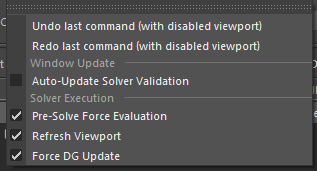

.. _solver-ui-ref:

Solver UI
=========

The Solver UI is the primary interface to using the internal solver
command (`mmSolver`).

.. figure:: images/tools_solver_ui_overview.png
    :alt: Solver User Interface
    :align: center
    :scale: 50%

    Solver User Interface

The shelf tools will open or run the solver.

.. figure:: images/tools_shelf_icons_solver.png
    :alt: Node Solver Shelf Icons
    :align: center
    :width: 30%

Input Objects
~~~~~~~~~~~~~

.. figure:: images/tools_solver_ui_widget_objects.png
    :alt: Solver Input Objects
    :align: right
    :scale: 50%

The Objects are the inputs to the current Solve. This will display
of Markers used for detecting deviation.
To display the Markers, and the related objects, you may turn on/off
the ``CAM``, ``MKR`` and ``BND`` buttons.

There are various columns showing attributes of the input Objects.
To display the column visiblity, use the Edit menu.

.. list-table:: Input Object Fields
   :widths: auto
   :header-rows: 1

   * - Field
     - Description

   * - Node
     - The input Object's Node.

   * - Weight
     - The weight the Marker will have in the solver. Higher values
       give an importance to this Marker, at the expense of other
       Markers.

   * - Frame Deviation
     - The deviation, in pixels, of the Marker on the current frame.

   * - Average Deviation
     - The average deviation, in pixels, of the Marker across all
       valid frames.

   * - Maximum Deviation
     - The maximum deviation and frame number on the Marker.

Output Attributes
~~~~~~~~~~~~~~~~~

.. figure:: images/tools_solver_ui_widget_attributes.png
    :alt: Solver Output Attributes
    :align: right
    :scale: 50%

This section of the UI shows the Attributes solved.

.. list-table:: Output Object Fields
   :widths: auto
   :header-rows: 1

   * - Field
     - Description
   * - Attr
     - The ``Attribute`` column displays nodes and attributes added
       into the active Collection.
   * - State
     - The State column displays if the attribute is Static or
       Animated.

Solver Tabs
~~~~~~~~~~~

The Solver tabs define the different solvers and the options for each
solver. The different solvers tabs share options, such as frame range,
but each Solver tab is independent.

The documentation for each Solver tab is below.

.. toctree::
    :maxdepth: 2

    tools_solver_ui_tab_basic
    tools_solver_ui_tab_standard
    tools_solver_ui_tab_legacy

Menus
~~~~~

File Menu
+++++++++

.. figure:: images/tools_solver_ui_menu_file.png
    :alt: File Menu
    :align: right
    :scale: 50%

The ``File`` menu contains features to create and manipulate the
overall use of the Solver UI, such as Collections.

.. list-table:: File Menu
   :widths: auto
   :header-rows: 1

   * - Name
     - Description
   * - New Collection
     - Create a new Collection node.
   * - Rename Collection
     - Renames the active Collection with a pop-up dialog.
   * - Remove Collection
     - Deletes the active Collection.
   * - Close Window
     - Closes the Solver UI window.

Edit Menu
+++++++++

The ``Edit`` menu displays options and features for how to change the
solve or the usage of the Solver UI.

.. list-table:: Edit Menu
   :widths: auto
   :header-rows: 1

   * - Name
     - Description
   * - Undo (without UI update)
     - Performs an undo operation, while stopping the viewport from
       evaluating.
   * - Redo (without UI update)
     - Performs a redo operation, while stopping the viewport from
       evaluating.
   * - Auto-Update Solver Validation
     - When an option in the UI changes, the Solver Validation will be
       re-evaluated.
   * - Pre-Solve Force Evaluation
     - Before a Solve is performed mmSolver will update the DG Node
       Graph.
   * - Refresh Viewport
     - The viewport will be updated during a solve.
   * - Force DG Update
     - mmSolver will ensure Maya updates the DG Node Graph.

View Menu
+++++++++

The ``View`` menu controls the visibility of the Solver UI, and parts of
the Maya Viewport during solves.

.. figure:: images/tools_solver_ui_menu_view.png
    :alt: View Menu
    :align: right
    :scale: 50%

.. list-table:: View Menu
   :widths: auto
   :header-rows: 1

   * - Name
     - Description

   * - Weight Column
     - The Marker weight column is displayed.

   * - Frame Deviation
     - The Marker per-frame deviation column is displayed.

   * - Average Deviation
     - The Marker average deviation column is displayed.

   * - Maximum Deviation
     - The Marker maximum deviation column is displayed.

   * - Display Attribute State
     - The attribute state column is displayed.

   * - Display Attribute Min/Max
     - The minimum and maximum value attribute columns are displayed.

   * - Display Attribute Smoothness
     - The smoothness variance attribute column is displayed.

   * - Display Attribute Stiffness
     - The stiffness variance attribute column is displayed.

   * - Display Image Planes
     - Image Planes will be visible while a solve is calculating,
       otherwise all Image Planes are hidden.

   * - Display Meshes
     - Polygon meshes will be visible while a solve is calculating,
       otherwise all meshes are hidden.

   * - Isolate Objects
     - mmSolver will hide all objects not used in a solve, while a
       solve is calculated.

Log Menu
++++++++

The ``Log`` menu allows configuration of the logged messages in the Script
Editor.

.. figure:: images/tools_solver_ui_menu_log.png
    :alt: Log Menu
    :align: right
    :scale: 50%

.. list-table:: Log Menu
   :widths: auto
   :header-rows: 1

   * - Name
     - Description
   * - Errors
     - Only errors will be displayed in the Script Editor.
   * - Warnings
     - Only warnings and errors will be displayed in the Script
       Editor.
   * - Info
     - Only info-level, warnings and errors will be displayed in the
       Script Editor.
   * - Verbose
     - Only extra information messages as well as warnings and errors
       will be displayed in the Script Editor.
   * - Debug
     - Only low-level debug information is displayed in the Script
       Editor, to help developers debug.

Python Function
~~~~~~~~~~~~~~~

The commands below are available for this tool, and allow hotkeys or
custom buttons to be created.

Open the Solver UI window:

.. code:: python

    import mmSolver.tools.solver.tool as solver
    solver.open_window()

Run the solve, just as if the user presses the "Solve" button in the UI:

.. code:: python

    import mmSolver.tools.solver.tool as solver
    solver.run_solve()

Run the solve, with the "Override Current Frame" checkbox turned *on*:

.. code:: python

    import mmSolver.tools.solver.tool as solver
    solver.run_solve_on_current_frame()

Run the solve, with the "Override Current Frame" checkbox turned *off*:

.. code:: python

    import mmSolver.tools.solver.tool as solver
    solver.run_solve_on_all_frames()
