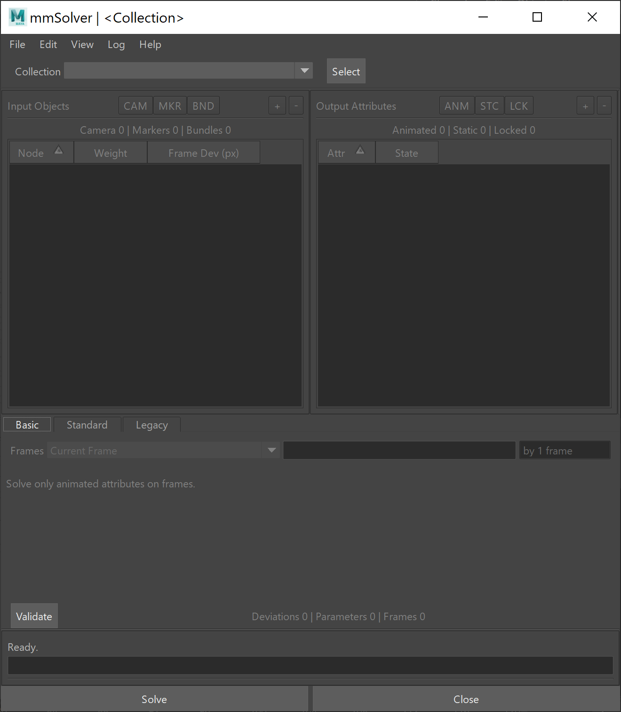

.. _solver-ui-ref:
 
Solver UI
=========

The Solver UI is the primary interface to using the internal solver
command (`mmSolver`).

    Solver User Interface

Objects
~~~~~~~

This section of the UI displays the marker objects that will be used for
solving.

Attributes
~~~~~~~~~~

This section of the UI shows the Attributes that will be used for
solving.

Solver Steps
~~~~~~~~~~~~

You can add multiple solver “steps”, each step is performed going
**downwards**, first #1, then #2, #3, etc.

When you hit the “solve” button you are performing all of the solve
steps.

The ‘Override Current Frame’ check-box allows the user to temporarily
override the time for all Solve Steps with the current frame. The
current frame value dynamically updates as the user changes the Maya
frame. The original solver frame numbers are always stored and never
overwritten.

Each Solver “step” contains:

-  Enabled
-  Frames
-  Attributes
-  Strategy

Enabled
^^^^^^^

Should we use the solver step or not?

This is a text input (currently), type “yes”, or “no”, “y” or “n”, or
“true” or “false” (and other common english words), to set the state.

Frames
^^^^^^

This is the list of frames to solve.

The frame numbers can be entered as “#-#” to define a range, or
“#,#,#,#” to define a list of individual frame numbers.

Examples are “1,10,20,30,40,50” or “10-20,30,40-50”.

Once text is entered the UI will evaluate the list and re-create the
string shown.

.. _attributes-1:

Attributes
^^^^^^^^^^

This is a filter of the attributes used in the solve step.

You may type into this field either one of these options:

-  "Animated Only" - Use only the animated attributes
-  "Static + Animated" - Use the static and animated attributes

Strategy
^^^^^^^^

This is the “solving strategy”; how the frames and attributes are
ordered in the solving process.

There are three currently supported strategies:

-  "Per-Frame" - Each frame is solved one-by-one.

-  "Two Frames Fwd" - Each pair of sequential frames are solved
   together; frame 1 and 2, then 2 and 3, then 3 and 4, etc.

-  "All Frames" - All frame numbers are solved together, at once (also
   called a “global solve”).

If the “Animated Only” attribute filter is currently used, then the
strategies above are unused and instead we loop over the frames
sequentially and solve each frame independent of any other frame. This
is the fastest method, but cannot solve Static attributes.

Python Function
^^^^^^^^^^^^^^^

The commands below are available for this tool, and allow hotkeys or
custom buttons to be run.

Open the Solver UI window:

.. code:: python

    import mmSolver.tools.solver.tool as solver
    solver.open_window()

Run the solve, just as if the user presses the "Solve" button in the UI:

.. code:: python

    import mmSolver.tools.solver.tool as solver
    solver.run_solve()

Run the solve, with the "Override Current Frame" checkbox turned *on*:

.. code:: python

    import mmSolver.tools.solver.tool as solver
    solver.run_solve_on_current_frame()

Run the solve, with the "Override Current Frame" checkbox turned *off*:

.. code:: python

    import mmSolver.tools.solver.tool as solver
    solver.run_solve_on_all_frames()
