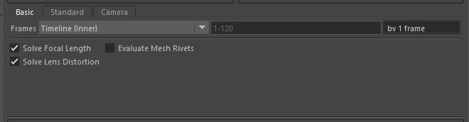

Basic Solver Tab
================

    Solver Basic Tab

The Basic solver will *only* solve animated attributes.
Static attributes will not be solved.

The Basic solver tab contains a stripped-down solver with minimal
options designed for simple per-frame animated attribute solving.

For many simple uses the Basic solver is all that is required.

Frames
------

The Frames option defines the list of frames to be solved.

Choose one of the options:

.. list-table:: Frames
   :widths: auto
   :header-rows: 1

   * - Option
     - Description

   * - Current Frame
     - Use the current Maya frame number to solve.

   * - Timeline (Inner)
     - Use the frame range of the timeline inner bar.

   * - Timeline (Outer)
     - Use the frame range of the timeline outer bar.

   * - Custom Frames
     - Manually type the frame numbers to be solved.

The frame numbers can be entered as '#-#' to define a range, or
'#,#,#,#' to define a list of individual frame numbers. Examples are
'1,10,20,30,40,50' or '10-20,30,40-50'.

The 'by # frames' option allow skipping the every # frames. For
example, with a value of 'by 2 frames', the every second frame is
chosen; 1, 3, 5, 7, 9, etc. Using this tool can speed up solving a
limited number of frames to build confidence in the solver attributes
currently created, and then reducing this number to '1' to solve each
frame.

Solver Options
--------------

The solver options below are extra options used to change how the
solver works internally.

Evaluate Mesh Rivets
~~~~~~~~~~~~~~~~~~~~

When enabled, *Evaluate Mesh Rivets* will change the internal
evaluation method to help solve "complex" node networks (such as Mesh
Rivets which have cyclical node connection networks).

Evaluation of "complex" node graphs can significantly impact performance.
It is recommended to turn this feature **off** unless the Maya scene
is not evaluating correctly without this feature.

Mesh Rivets, using the classic `rivet.mel`_ script can be evaluated using
this feature enabled.

.. note:: In mmSolver v0.3.x, this feature was known as *Evaluate
   Complex Node Graphs*.

.. _rivet.mel:
   https://www.highend3d.com/maya/script/rivet-button-for-maya
