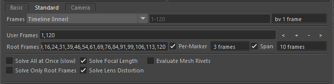

Standard Solver Tab
===================

    Solver Standard Tab

The Standard solver tab can solve both animated and static attributes.

When the Standard solver is executed, first the static and animated
attributes are solved using the 'Root Frames' option. After the 'Root
Frames' are solved, the animated attributes are solved per-frame using
the 'Frames' option.

If 'Frames' is set to 'Current Frame', then both static and animated
attributes are solved on the current frame. The user must take care to
ensure it is possible to solve the static attributes using only this
frame.

If the 'Solve Only Root Frames' option is checked, the second solve
using the Frames is not run, only the Root Frames are solved.

If 'Solve All At Once' option is checked, the Root Frames and Frames
are combined and both static and animated attributes are solved in one
solve process. Solving many attributes and frames in this way is very
slow and should be avoided.

Frames
------

The Frames option defines the list of frames to be solved.

Choose one of the options:

.. list-table:: Frames
   :widths: auto
   :header-rows: 1

   * - Option
     - Description

   * - Current Frame
     - Use the current Maya frame number to solve.

   * - Timeline (Inner)
     - Use the frame range of the timeline inner bar.

   * - Timeline (Outer)
     - Use the frame range of the timeline outer bar.

   * - Custom Frames
     - Manually type the frame numbers to be solved.

The frame numbers can be entered as '#-#' to define a range, or
'#,#,#,#' to define a list of individual frame numbers. Examples are
'1,10,20,30,40,50' or '10-20,30,40-50'.

The 'by # frames' option allow skipping the every # frames. For
example, with a value of 'by 2 frames', the every second frame is
chosen; 1, 3, 5, 7, 9, etc. Using this tool can speed up solving a
limited number of frames to build confidence in the solver attributes
currently created, and then reducing this number to '1' to solve each
frame.

Root Frames
-----------

The 'Root Frames' are used to solve static and animated attributes.

Beside the 'Root Frames' field are buttons for adding, removing and
changing the current frame to the next/previous root frame.

For more details on tools to change frame, create or remove root frames,
see the :ref:`Frame Tools <frame-tools-heading>`.

Solver Options
--------------

The solver options below are extra options used to change how the
solver works internally.

Evaluate Object Relationships
~~~~~~~~~~~~~~~~~~~~~~~~~~~~~

Check this option **on** to evaluate the Marker and Attribute relationships
- how the objects are connected.

With this feature turned on, *mmSolver* is able to use the relationship
between Markers and Attributes to improve performance. For example,
if Marker A does not affect node B, *mmSolver* can skip this calculation.

It is recommended to turn this check-box if you have many (eg, 10+)
Markers and Attributes in the solve, and/or when you are solving static
Attributes.

Evaluate Complex Node Graphs
~~~~~~~~~~~~~~~~~~~~~~~~~~~~

When enabled, *Evaluate Complex Node Graphs* will change the internal
evaluation method to help solve "complex" node networks (such as
Mesh Rivets which have cyclical node connection networks).

Evaluation of "complex" node graphs can significantly impact performance.
It is recommended to turn this feature **off** unless the Maya scene
is not evaluating correctly without this feature.

Mesh Rivets, using the classic `rivet.mel`_ script can be evaluated using
this feature enabled.

.. _rivet.mel:
   https://www.highend3d.com/maya/script/rivet-button-for-maya
